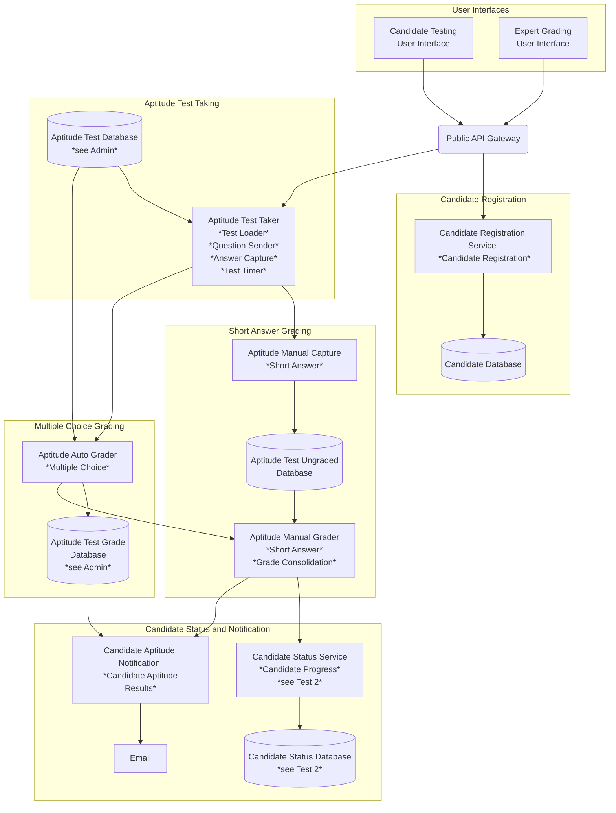
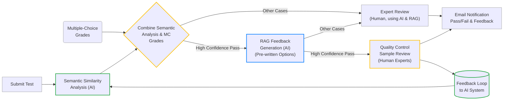
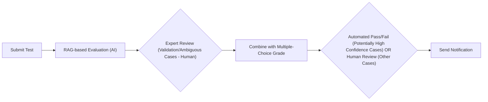
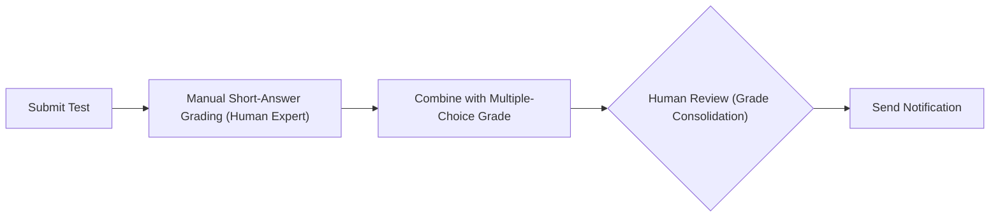
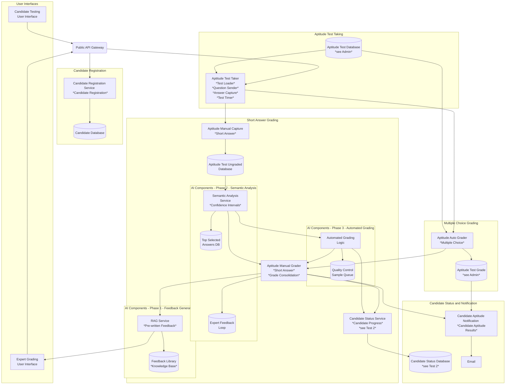

# ADR - Scaling Short-Answer Grading with Semantic Similarity and RAG

## ADR ID: 001

## Date: 2025-02-16

## Status: Proposed

## Context

Certifiable, Inc. anticipates a 5-10X increase in test submissions due to expanding enrollment and new partnerships. Test 1 comprises multiple-choice questions, which are automatically graded, and short-answer questions, which require manual grading by expert software architects. This manual process is time-consuming, taking up to three hours per candidate for grading short-answer questions, and poses a risk to the company's one-week grading guarantee if enhancements are not implemented. Maintaining trust in grading integrity is crucial, as even minor misclassifications could damage the brand's reputation. The company faces scalability constraints, as hiring additional expert graders is both costly and slow, and a fully automated approach without oversight might undermine trust in the nuanced evaluation of architect skills. Any new grading solution must integrate smoothly with existing test systems and data pipelines.

## Problem Statement

The challenge for Certifiable, Inc. is to introduce AI-driven short-answer grading to handle increased volumes without compromising accuracy and reputation. The solution must be scalable to manage the anticipated surge in submissions while maintaining or exceeding current human accuracy standards, with minimal false positives or negatives. Speed and efficiency are crucial for both candidate satisfaction and operational effectiveness. Retaining human oversight for ambiguous cases is essential to ensure the highest quality of results. Additionally, the system must integrate seamlessly with existing test interfaces and internal data repositories.

**Current Architecure**

## Decision

Certifiable, Inc. will implement a hybrid AI-assisted grading system for Test 1 short-answer questions to enhance efficiency and maintain grading quality. The system will employ semantic similarity models to evaluate candidate short-answer responses by comparing them to a set of top-selected answers. These semantic analysis results, combined with automatically graded multiple-choice scores, will be used to determine the grading path.  A Retrieval-Augmented Generation (RAG) system will be integrated to expedite the expert review process and ensure consistent feedback. For cases where both the semantic similarity model and multiple-choice scores indicate high confidence in a passing grade, the system will automatically approve the candidate. For all other cases, including borderline results and those with lower confidence scores, expert graders will retain final decision-making authority, leveraging the AI-provided suggestions and feedback to efficiently and accurately assess candidate performance.

### Option Comparison: AI-Assisted Short-Answer Grading for Test 1

This section compares three options for addressing the challenge of scaling short-answer grading for Test 1 at Certifiable, Inc.:

#### 1. Option 1: Semantic Similarity Evaluation + RAG Feedback (Chosen Solution)

**One-line Description:**  This option uses AI for initial semantic analysis and RAG-based feedback generation, followed by expert review for most cases, but automates pass/fail decisions for high-confidence cases, skipping human review in those instances, while still incorporating both AI suggestions and human judgment in the overall grading process.

**Justification:**

*   **Efficiency and Scalability:** Semantic similarity models are computationally efficient, allowing for rapid processing of large volumes of data.
*   **Cost-Effectiveness:** Avoids the need for extensive fine-tuning of large language models, reducing financial and data requirements.
*   **Enhanced Feedback and Focused Human Oversight:** RAG provides contextually relevant feedback and highlights areas for expert review.
*   **Maintaining Quality and Integrity:** Hybrid approach combines AI efficiency with essential human oversight for ambiguous cases.

**Trade-off Analysis:**

*   **Accuracy vs. Cost:** Balances accuracy needs with budgetary constraints by using semantic similarity instead of more expensive LLMs for core evaluation.
*   **Speed vs. Human Involvement:** Accelerates grading with AI while retaining human oversight for quality assurance.
*   **Feedback Quality vs. Implementation Complexity:** Justifies the added complexity of RAG with enhanced feedback quality and fairness.

**Pros:**

*   Computationally efficient and scalable.
*   Cost-effective development and deployment.
*   Transparent and auditable evaluation process.
*   Provides quantitative scores for consistent grading.
*   RAG effectively enhances feedback and expert efficiency.

**Cons:**

*   Potentially less nuanced evaluation than LLM-based approaches.
*   RAG implementation adds some complexity to the system.

---

#### 2. Option 2: RAG for Evaluation (Alternative Solution)

**One-line Description:** This option proposes using RAG, potentially with LLMs, for direct AI-driven evaluation of short-answer questions, with human review for validation and ambiguous cases, and potential automation for high-confidence outcomes.

**Justification:**

*   **Contextual Understanding:** RAG, especially with LLMs, can understand context and nuanced language for holistic evaluation.
*   **Flexibility and Adaptability:** More flexible in handling variations in candidate responses and partially correct answers.
*   **Potential for More Human-Like Assessment:** Can mimic human assessment by considering various aspects of responses.
*   **Direct Feedback Integration (Potentially):**  Evaluation model could be adapted for feedback generation.

**Trade-off Analysis:**

*   **Accuracy and Reliability Concerns:** Potential for less reliable and consistent evaluations compared to semantic similarity.
*   **Computational Cost and Latency:** Significantly higher computational cost and latency, impacting scalability.
*   **Development and Fine-tuning Complexity:** Complex to develop, fine-tune, and validate for reliable evaluation.
*   **Explainability and Auditability:**  Less transparent and auditable evaluation process.

**Pros:**

*   Potentially more nuanced and human-like evaluation.
*   High flexibility in understanding diverse responses.
*   Potential for integrated evaluation and feedback.

**Cons:**

*   Accuracy and reliability are less certain.
*   High computational cost and scalability challenges.
*   Complex development and validation process.
*   Lack of explainability and auditability raises trust concerns.
*   Quantitative assessment can be challenging.

---

#### 3. Option 3: Manual Grading (Baseline - Current Process)

**One-line Description:**  This option represents the current process of fully manual grading by expert architects, involving human evaluation of short-answer questions, combination with multiple-choice scores, and final human review for pass/fail decisions.

**Justification (for current use):**

*   **High Accuracy and Nuance:** Human experts can provide the most nuanced and accurate evaluation of complex short-answer questions.
*   **Flexibility and Adaptability:** Experts can adapt to unexpected or novel responses and apply complex judgment.
*   **High Perceived Integrity:** Manual grading is often seen as the gold standard for high-stakes assessments, fostering trust.

**Trade-off Analysis (for scaling to increased volume):**

*   **Scalability Limitations:**  Manual grading does not scale effectively to handle a 5-10X increase in submissions.
*   **Time-Consuming and Slow:**  Grading time per candidate is high (up to 3 hours), leading to delays and bottlenecks.
*   **High Cost:**  Hiring and training enough expert graders to handle increased volume is expensive and time-consuming.
*   **Consistency Challenges:**  Maintaining consistency across multiple human graders can be difficult without rigorous training and calibration.

**Pros:**

*   Highest potential for accuracy and nuanced understanding.
*   Maximum flexibility and adaptability.
*   Strong perception of grading integrity.

**Cons:**

*   Extremely poor scalability for increased submission volume.
*   Very time-consuming and slow grading process.
*   High operational costs for increased volume.
*   Potential for inconsistency across graders.

---

#### Justification for Choosing Option 1: Semantic Similarity + RAG Feedback

Certifiable, Inc. has strategically chosen **Option 1: Semantic Similarity Evaluation combined with RAG for Feedback** as the optimal solution for AI-assisted short-answer grading for Test 1. This decision is grounded in the need to balance several critical factors: **scalability, cost-effectiveness, accuracy, reliability, transparency, and maintaining trust** in the certification process.

While Option 2 (RAG for Evaluation) offers the allure of potentially more nuanced assessments, its significant drawbacks in terms of **reliability, scalability, cost, and explainability** make it a less practical and riskier choice for Certifiable, Inc.  Option 3 (Manual Grading), while highly accurate in principle, is simply **unscalable and unsustainable** for the anticipated surge in test submissions.

Option 1 provides the most **pragmatic and effective balance**. It leverages the computational efficiency and transparency of semantic similarity for core evaluation, ensuring scalability and cost-effectiveness. Simultaneously, it strategically incorporates RAG to enhance the expert grading process by providing valuable feedback options and focusing human graders' attention, thereby improving both **efficiency and feedback quality** without sacrificing **reliability or transparency**.  This hybrid approach allows Certifiable, Inc. to address the urgent need for scalability while upholding the crucial standards of accuracy, integrity, and trust that are essential for its certification program's reputation and success.

### Assumptions

**Quality of Training Data:**
It is assumed that the historical data used to train the semantic similarity models is of high quality, comprehensive, and representative of the types of responses candidates will provide. This includes having a well-defined set of ideal answers for comparison.

**Model Performance:**
We assume that the semantic similarity models will accurately assess the quality of short-answer responses based on their similarity to ideal answers. This includes the expectation that the models can effectively handle variations in phrasing and terminology used by candidates.

**Human Oversight Effectiveness:**
We assume that human experts will be able to effectively review and validate the AI-generated scores, especially for borderline cases. This includes the expectation that experts can provide valuable feedback to improve the AI models over time.

**Feedback Utility:**
It is assumed that the feedback generated by RAG will be relevant, actionable, and clear enough for candidates to understand their performance and areas for improvement.

**Integration Capability:**
It is assumed that the AI solutions can be seamlessly integrated with existing test delivery and grading systems without significant technical challenges or disruptions to current workflows.

**Data:**
We assume the data from the completed tests includes annotations indicating pass/fail status and links to the feedback provided to candidates for each short-answer question.

**Short Answer Length:**
We assume that candidate responses to short-answer questions will be no longer than 200 words.  For responses shorter than 50 words, the system may not utilize the RAG component for highlighting specific areas within the answer, and may instead rely primarily only on semantic classification.

## Implementation Plan (Option 1)

### Phase 1: Feedback Generation Setup

During this phase, the RAG system will be configured and integrated to perform two key functions:

1.  **Generate Pre-written Feedback Options:** Based on the candidate's response to a *specific question* and its semantic similarity score, the RAG system will provide a selection of pre-written feedback statements *relevant to that question*. These statements will focus on aspects of the answer's correctness, completeness, and clarity, *but will not include an overall pass/fail judgment*.

2.  **Highlight Areas for Expert Attention (for answers > 50 words):** For candidate responses exceeding 50 words, the RAG system will analyze the text to identify potential areas of concern, strengths, or inconsistencies. These areas will be highlighted within the expert grading interface, drawing the grader's attention to specific parts of the response that may require more careful consideration. This is *not* a final grading decision, but rather a tool to assist expert review.

The RAG system will utilize the LLM Gateway (see ADR 4 TODO). The system will be integrated into the expert grading interface, presenting these options alongside the candidate's response and the semantic similarity score (from Phase 2). Experts can select, modify, or write their own feedback, but the RAG suggestions are intended to significantly reduce the time spent crafting feedback from scratch. The overall pass/fail decision and comprehensive feedback will be determined by the expert after reviewing all questions.

**Tests:**

*   **Expert Feedback Quality & Efficiency Assessment:**
    *   1 or 2 designated experts will create a representative sample of 50 short-answer responses, varying in quality and length, *across different questions*, and define the ideal answer and feedback for *each question*.
    *   A group of 10 experts (from the 300) will grade these responses *without* using the RAG system. This establishes a baseline for grading time and feedback quality.
    *   The *same* group of 10 experts will then grade the *same* 50 responses *using* the RAG system (both pre-written feedback and highlighting).
    * We will measure:
        1.  **Average Grading Time Reduction:** The difference in average time spent grading each response with and without RAG.
        2.  **Feedback Quality Score:** A separate group of 3 experts (from the 300, and not involved in the grading) will blindly evaluate the quality of the feedback provided in both the baseline and RAG-assisted scenarios. Finally the designated experts will evaluate the results accessing for clarity, relevance, and actionability of the feedback *for each question*.

**Success Criteria:**

*   **Time Reduction:** The average grading time per response is reduced by at least 40% when using the RAG system compared to the baseline.
*   **Feedback Quality Maintenance:** The average feedback quality score remains the same or improves (within a tolerance of +/- 5%) when using the RAG system compared to the baseline.

### Phase 2: Integration of Semantic Analysis and Feedback Loop

In this phase, the semantic similarity analysis will be fully integrated into the grading system. The analysis will evaluate candidate responses against the predefined set of top-selected answers, providing automated grading suggestions (pass/fail recommendations) along with confidence scores for each response. Experts will receive these suggestions alongside the RAG-generated feedback options (from Phase 1) in the grading interface. A feedback loop will be established, allowing experts to flag cases where they disagree with the AI's suggestion or when the confidence score is low. This feedback, along with the expert's final grading decision, will be used to refine the semantic similarity model.

**Tests:**

*   **Semantic Analysis Accuracy and Expert Agreement:**
    *   Using a new representative sample of 100 short-answer responses (distinct from the Phase 1 sample), the semantic similarity model will generate pass/fail recommendations and confidence scores.
    *   A group of 10 experts (the same group used in Phase 1) will independently grade these responses, using the RAG-generated feedback options but *without* seeing the AI's recommendations.
    *   We will measure:
        1.  **AI Accuracy:** The AI's pass/fail recommendation matches the expert's final decision at least 95% of the cases.
        2.  **Expert Override Rate:** The percentage of responses where experts override the AI's recommendation, categorized by the AI's confidence score (high, medium, low).

**Success Criteria:**

*   **AI Accuracy:** The AI's pass/fail recommendations achieve at least 90% accuracy compared to the expert's final decisions.
*   **Targeted Override Rate:** The expert override rate is below 5% for responses where the AI's confidence score is "high," and below 20% for medium. This indicates that experts are generally agreeing with the AI when it's confident, and that the confidence score is a useful indicator. There is no defined override rate to low confidence score.
*   **Semantic Analysis Refinement:** The expert feedback (flags and final grading decisions), along with the corresponding candidate responses and scores, will be stored in a database and used to retrain and refine the semantic similarity model. This iterative process will improve the model's accuracy and reduce the need for expert overrides in the future. This refinement will be an ongoing process.

### Phase 3: Automated Grading with Quality Control

In this phase, the system will combine the semantic similarity score (from Phase 2) and the multiple-choice score to make automated pass/fail decisions. Cases with high confidence in both scores will be automatically graded as "pass," allowing candidates to proceed to Test 2. A random sample of 5% of these automated passes will be sent to a quality control queue for review by a group of 3 experts. For cases where either the semantic similarity confidence or the multiple-choice score is below a predefined threshold, the response will be flagged for manual review by an expert.

**Tests:**

*   **Automated Grading Accuracy and False Positive/Negative Rates:**
    *   After implementing the automated grading logic, we will analyze a historical dataset of at least 500 graded Test 1 submissions (with known pass/fail outcomes).
    *   We will measure:
        1.  **False Positive Rate:** The percentage of candidates who were incorrectly passed by the automated system (should have failed).
        2.  **False Negative Rate:** The percentage of candidates who were incorrectly failed by the automated system (should have passed).
        3. **Accuracy:** Percentage of correct automated decisions.

**Success Criteria:**

*   **Low False Positive Rate:** The false positive rate is below 5%. This is crucial for maintaining the integrity of the certification. In case 1 out of 20 moves incorrectly to the second phase the time saved in experts reviews in the first test is still higher than the necessary to review the solution presented by the candidate in the second test.
*   **Acceptable False Negative Rate:** The false negative rate is below 0.1%. This shouldn't happen as removes trust on the company and generates work on revision processes.
*   **Accuracy**: The accuracy of the automatic grading should be greater than 95%

---

Refer to the [diagram](#1-option-1-semantic-similarity-evaluation--rag-feedback-chosen-solution) in the section **Option 1: Semantic Similarity Evaluation + RAG Feedback (Chosen Solution)** for a visual representation of the AI-assisted short-answer grading process.

This solution employs AI for Phase 2 (green) semantic analysis, combines it with multiple-choice grades at a Phase 3 (yellow) decision point; for 'High Confidence Pass' cases, it automates pass/fail with Phase 1 (blue) RAG-generated feedback and quality control, while 'Other Cases' proceed to baseline expert review, which also utilizes RAG.

## Resulting Architecture

The resulting architecture for **Test 1 short-answer grading** combines AI-driven semantic analysis with human oversight to enhance efficiency and maintain accuracy. Semantic similarity models analyze short-answer responses, comparing them to top-selected answers and generating scores with confidence intervals. These scores are combined with multiple-choice results to create an overall confidence level for pass/fail decisions. High-confidence pass cases are automated, allowing candidates to proceed to Test 2 directly, with a small sample undergoing human quality control. Borderline cases and those with lower confidence are flagged for expert review. **To further streamline expert grading and ensure consistent feedback,** a Retrieval-Augmented Generation (RAG) system provides **pre-written feedback options** and relevant examples, particularly for ambiguous responses. A feedback loop is implemented, allowing expert graders to refine the semantic analysis model continuously. This hybrid approach optimizes grading speed, reduces expert workload, and ensures consistent, high-quality certification outcomes.

## Expected Outcomes and Impact

The implementation of this AI-assisted grading system is expected to deliver significant improvements in efficiency, cost-effectiveness, and consistency, while maintaining the high standards of accuracy and integrity required for Certifiable, Inc.'s certification program.

**Overall Success Criteria:**

*   **Significant Reduction in Grading Time:** The primary measure of success will be a substantial reduction in the average time required to grade *all* Test 1 submissions. We aim for an overall reduction of at least 80% in grading time compared to the fully manual process. This includes both the automated grading of high-confidence cases and the time savings for experts using RAG in the remaining cases.
*   **Maintain or Improve Grading Accuracy:** The overall accuracy of the grading process (combining automated and human-reviewed cases) must remain at or above 98%, as measured against a top selected answers dataset graded by designated experts.
* **Low False Positive Rate:** Below 5%
* **Low False Negative Rate:** Bellow 0.1%

**Time Savings for Humans:**

For the Test 1 submissions that still require human review, the use of RAG (pre-written feedback and highlighting) is projected to reduce the average time spent by human experts by at least 60%. This translates to significant cost savings and allows experts to focus on more complex and nuanced assessments.

Initially, with 20% of cases fully automated and a 60% reduction in human review time for the remaining 80%, the total time spent grading is reduced to 32% of the original time required for fully manual grading.

Furthermore, after initial tuning and continuous improvement of the thresholds, RAG, and semantic analysis processes, we aim to automate 40% of passing cases and achieve a 70% reduction in human review time for the remaining cases. This would result in a total grading time of just 18% of the original fully manual grading time.

**Other Impacts:**

*   **Improved Feedback Consistency:** The use of RAG-generated feedback options is expected to improve the consistency of feedback provided to candidates, ensuring fairness and reducing ambiguity.
*   **Faster Turnaround Times:** The overall reduction in grading time will lead to faster turnaround times for candidates, improving their experience and allowing them to progress through the certification process more quickly.
*   **Reduced Operational Costs:**  The decreased reliance on manual grading will lead to significant cost savings in the long run, as fewer expert grader hours will be required.
*   **Scalability:** The AI-assisted system is designed to be scalable, allowing Certifiable, Inc. to handle the anticipated 5-10X increase in test submissions without a corresponding increase in costs or delays.

## References

1.  Sultan, A., & Salem, A. M. (2022). [Automated short answer grading systems: A systematic literature review](https://link.springer.com/article/10.1007/s10462-021-10068-2). *Education and Information Technologies*, *27*(7), 9485-9519.
2.  Lewis, P., Perez, E., Piktus, A., Petroni, F., Karpukhin, V., Goyal, N., ... & Kiela, D. (2020). [*Retrieval-augmented generation for knowledge-intensive NLP tasks*](https://proceedings.neurips.cc/paper/2020/hash/6b493230205f780e1bc26945df7481e5-Abstract.html). *arXiv preprint arXiv:2005.11401*.
3.  "Human-in-the-Loop Machine Learning." [*Google AI Blog*](https://ai.googleblog.com/2018/09/human-in-loop-machine-learning.html).
