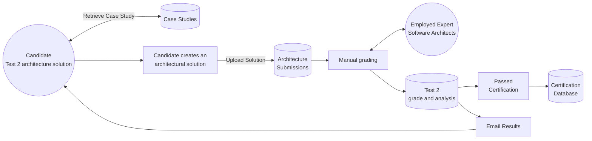
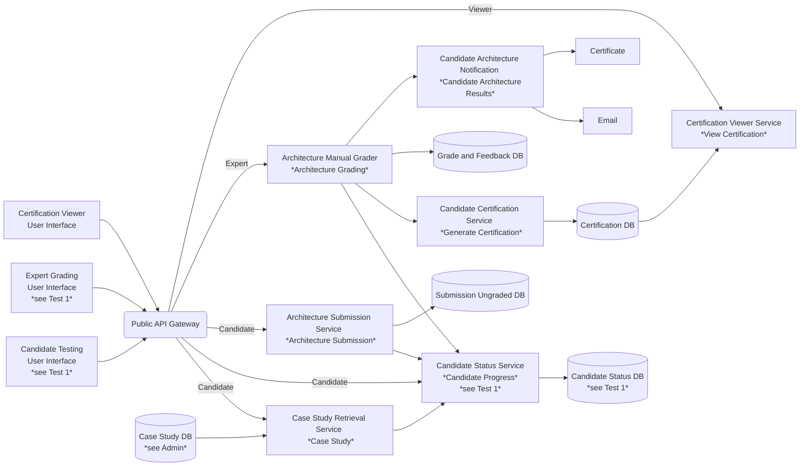
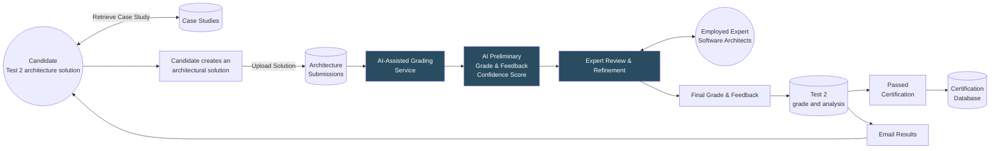
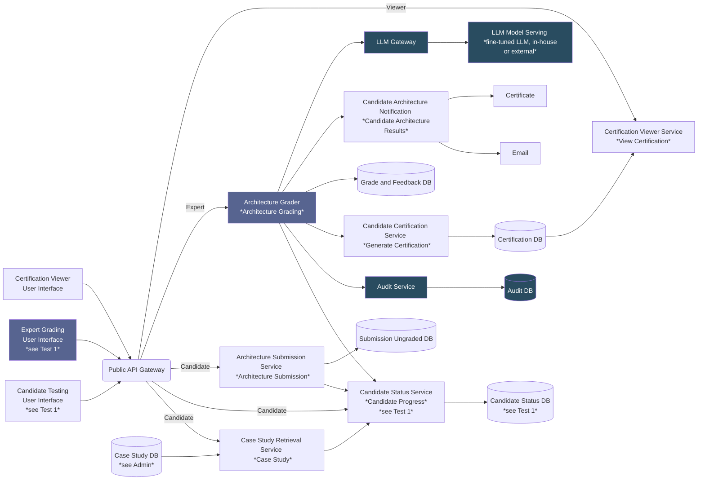
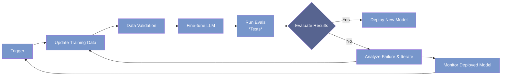

# ADR: AI-Assisted Grading of Architecture Submissions

## ADR ID: 002

## Date: 2025-02-14

## Status: Proposed

---

## 1. Introduction

This ADR proposes implementing and AI-Assisted grading system for architecture test submissions. It would use a hybrid approach with the "human in the loop". It would also include the feedback generation using a similar approach.

---

## 2. Context and Problem Statement

**Background:**

Certifiable, Inc.'s SoftArchCert system requires candidates to submit full architectural solutions (Test 2) as part of their certification process. Currently, expert architects manually review and grade these submissions. With the expected increase in candidate volume and the complexity of architectural designs, the manual grading process is labor-intensive, time-consuming, and subject to a lot of nuances.

**Current Certification Process (Test 2: Architecture Solution):**

**Current Certification Testing Architecture - Test 2: Architecture Solution:**

**Problem:**

- Manual grading of architecture submissions takes approximately 8 hours per candidate.
- The expected overall increase in volume (5–10×) in a short term expansion and the 21% increase over the next 4 years will strain the expert resources.
- The architecture submissions are complex and nuanced, making fully automated grading risky.
- In addition to grading, it would be useful some help in providing detailed, actionable feedback about the candidate’s submission. Producing such feedback manually is time-consuming and maybe prone to inconsistencies.
- Grading accuracy and transparency is critical because mistakes can result in serious damage to the candidates' careers and to Certifiable, Inc.'s reputation.

---

## 3. Decision

**Chosen Approach:**

Implement an AI-Assisted Grading Service for architecture submissions that:

- Uses a private deployment of an LLM model or an LLM API from an external provider - both multimodal with text and vision capabilities.
- **Grades the candidate's submission:** With the help of AI generates a preliminary grade based on the candidate's submission.
- **Generates Integrated Feedback:** Produces detailed, AI-generated feedback that highlights the positives and the negatives in the candidate’s submission. This pre-filled feedback covers areas such as missing components, deviations from best practices, and structural issues.
- The generated grades and feedback provide a preliminary evaluation that is then reviewed and refined by expert software architects.
- **Generates a confidence score:** Integrates confidence scoring to further assist the experts.
- Adds auditing to support expert overrides and continuous improvement. This will provide additional transparency to the grading process, allowing reviews, responding to complaints and other related tasks. It can also be used in the fine-tuning of models and/or prompt improving tasks and building additional tests.

**Changed Certification Process (Test 2: Architecture):**

**Changed Certification Testing Architecture - Test 2: Architecture Solution:**

Changed components:

- The Architecture Grader will be changed to use the LLM Gateway to generate the grades, feedback and confidence scores. It will be changed to support the changes to the Expert Grading User Interface. Additionally, it will be changed to use the Audit Service to support the new auditing features.
- The Expert Grading User Interface will be updated to allow the experts to review and refine the new AI-generated grades and feedback while also presenting the confidence scores.

New components:

- The LLM Gateway will provide the LLM services to other components. The component relevant in this case is the Architecture Grader. This service will allow to switch between model providers, in-house or external.
- The LLM Model Serving represents in-house or external LLM models. These can be fine-tuned and/or prompt according to the specific needs of the architecture submissions. Its actual design and implementation depends on the Research and Prototype of the [Implementation Plan](#8-implementation-plan) phase. It will be used by the LLM Gateway.
- The Audit Service will provide the necessary auditing features to support the afore-mentioned improvement activities.

**Suggested fine-tuning pipeline:**

Depending on the outcome of the Research and Prototype of the [Implementation Plan](#8-implementation-plan), this could be a fine-tuning pipeline example.

---

## 4. Decision Drivers and Assumptions

### Decision Drivers

- **Accuracy and Fairness:**  
  Ensure grading accuracy and transparency in order to avoid damaging candidates’ careers and company's reputation.
- **Scalability:**  
  The solution must scale to handle a significant increase in architecture submissions.
- **Efficiency:**  
  Reduce the burden on experts by providing both preliminary grades and pre-filled feedback, thereby speeding up the certification process.
- **Transparency:**  
  Maintain detailed audit logs, confidence scoring, and include human overrides to support trust in the AI system.
- **Integration:**  
  Must integrate seamlessly into the existing SoftArchCert workflow and ways of working.

### Assumptions

- The submissions are composed of a set of diagrams and textual descriptions, which can be processed by the AI model. The submission process can undergo small adjustments to accommodate the new requirements without compromising the spirit of the test and certification.
- There are documented guidelines and reference/golden examples for grading and feedback generation, currently in use by the experts. These materials will be used to build test cases which are essential to support the different design and development activities.
- Because the experts earn per hour, it would be an option to increase in number as necessary but we assume it would be a lengthy task and not a viable option.
- We assume that the 5-10x increase will be gradual and that the experts will be willing to work more hours to accommodate the additional load. Their participation is also critical in the research and development activities.
- Roughly speaking, the cost structure inputs ($50/hr for the experts and $800 per exam) and the increase in number of candidates, allows a linear increase in the infrastructure spending. This should be considered when researching and evaluating the AI approach and the infrastructure needed to support it.
- We estimate that gradually reducing from 3h to 1h grading test1 (not handled in this ADR) and from 8h to 5h grading test2 would be a good outcome in this initial phase.

---

## 5. Considered Options

1. **Maintain Full Manual Grading and Feedback:**

   - **Pros:** Completely trusted, human-centric.
   - **Cons:** Does not address the scalability issue; increased candidate load will overwhelm expert capacity, and manual feedback generation can be inconsistent.

2. **Fully Automated Grading with LLM:**

   - **Pros:** Improved efficiency and scalability.
   - **Cons:** High risk in accurately evaluating complex architectural designs; risk of misjudgment while grading, reduced trust and misplaced feedback generation. Software architecture designs are nuanced by nature making it challenging for AI to autonomously solve the grading task.

3. **Hybrid AI-Assisted Grading with Integrated Feedback (Chosen Option):**

   - **Pros:** Balances efficiency with expert oversight; preliminary AI grading and draft feedback reduce manual workload while allowing experts to verify and refine both grades and commentary.
   - **Cons:** Increased integration complexity, requiring confidence thresholds, interactive user interfaces for feedback editing, and audit mechanisms.

4. **Rule-Based System:**
   - **Pros:** Transparent, deterministic outcomes.
   - **Cons:** Inflexible in handling the creative and nuanced aspects of architectural submissions and incapable of generating rich, tailored feedback.

---

## 6. Trade-Off Analysis

- **Automation vs. Human Oversight:**

  Fully automated solutions may provide faster outcomes, yet risk missing critical nuances in both grading and feedback. The hybrid approach leverages AI to draft both the grade and the feedback for expert review, thereby ensuring that human judgment remains the final arbiter.

- **Complexity vs. Maintainability:**

  Incorporating AI-assisted grade and feedback generation features increases system complexity and ongoing maintenance. However, this complexity is justified by the expected increase in number of candidates while continuing to provide consistent, actionable feedback and adding transparency from logging AI rationale.
  The addition of an LLM gateway adds some complexity but allows for flexibility in the future. It enables the team to switch between different combinations without changing the services using it.

- **Scalability vs. Accuracy:**

  Automating preliminary grading and feedback generation enhances scalability. Nonetheless, to maintain accuracy, the AI-generated content must be subjected to full expert review. Adding a confidence score should help the experts' reviews and improve the process as the system evolves.

- **Transparency vs. Proprietary AI Limitations:**

  Detailed logging of both grading decisions and feedback rationale adds transparency, meeting regulatory and quality expectations, but introduces moderate design and resource overhead.

---

## 7. Consequences

**Positive Consequences:**

- **Workload Reduction:**

  AI pre-fills grading suggestions and detailed feedback, significantly reducing the expert review burden.

- **Faster Turnaround:**

  Candidates receive rapid preliminary evaluations along with actionable, AI-generated feedback, thereby speeding up the certification cycle.

- **Enhanced Feedback Quality:**

  The integrated feedback mechanism provides experts with a consistent baseline from which they can quickly refine comments. This approach helps ensure that all candidates receive detailed, informative feedback.

- **Continuous Improvement:**

  Audit logs and confidence metadata support ongoing model refinements and enable continuous process improvement.

**Negative Consequences:**

- **Increased Development Complexity:**

  Developing and integrating a user interface that supports interactive feedback editing and confidence scoring adds to the overall system complexity.

- **Ongoing Calibration:**

  AI models and/or prompts used to generate grades and feedback require periodic fine-tuning, calibration and adaptation, including monitoring against test cases.

- **Validation Risks:**

  Over-reliance on AI-generated feedback without sufficient expert oversight may lead to errors if the pre-filled comments are not carefully validated.

---

## 8. Implementation Plan

1. **Research and Prototype Development:**

   This is probably the most critical phase of the project and should be conducted with the utmost care and attention to detail with respect to the research and production of the tests. It can also include a small prototype that should be tested with a diverse set of architectural submissions to ensure that it can accurately grade and provide feedback on a wide range of designs. The UX designs can be very basic at this stage, allowing the team to focus on the tests and core functionality of the system.

   - Together with a team of selected experts, the project team will conduct manual tests using available models and existing golden examples to determine the best approach to grading and feedback generation. This step is essential to validate the proposed solution and ensure that it meets the required quality standards.

   - Given the latest developments we believe that fine-tuning a pre-trained like Llama 3.2 Vision or using an LLM provider like Google Gemini or other that can deliver identical capabilities would be good approaches. As stated later, we're assuming there are guidelines and golden examples that can be used.

   - We don't eliminate the possibility of using the existing models (opensource or proprietary) without fine-tuning and relying only on prompting techniques. The decision to fine-tune or not should become clear during this phase.

   - The confidential requirements should be taken into account when choosing the model, the provider, in-house vs external and so on. The team should also consider the costs and the infrastructure needed to support the chosen model.

   - One critical outcome from this phase is also a set of test cases as exhaustive as necessary that can be used to validate the system, both from the start but also during future changes. Those tests should also be reevaluated in the future when modifying existing case studies or adding new ones.
   - Develop a prototype that conforms to generate both preliminary grades and detailed draft feedback insights using historical graded submissions as benchmarks.

2. **Expert Grading User Interface Re-design:**

   The existing Expert Grading User Interface will be re-designed to support the new AI-assisted grading and feedback generation features.

   - The candidate’s architectural submission side-by-side to the “golden standard.”

   - A dedicated, pre-filled feedback text area containing AI-generated commentary.

   - Controls for experts to adjust the suggested grade and modify or override the AI-generated feedback.

3. **Model Training and Deployment**:

   Depending on the results of the research and prototype development phase, the team will proceed with the training and deployment of the AI model. This phase will include:

   - Evaluate the options for training the AI model, including fine-tuning a pre-trained model and deploying it in-house or using an external API that also offers fine-tuning features.

   - Implement a comprehensive pipeline for the optional fine-tuning, deployment, testing, and monitoring of the AI solution.

   - Either option will include the development of a backend service (LLM gateway) that can abstract whether the model is in-house or external, allowing the team to switch between them if necessary.

4. **Architecture Grader, LLM Gateway and Audit Service:**

   The current Architecture Manual Grader component will be changed to use the new LLM Gateway and Audit Service. It will do so to provide the Expert Grading User Interface with the necessary functionality to manage the grades, feedback, and confidence scores.
   The new LLM Gateway and Audit Service will be developed to support the new AI-assisted grading and feedback generation features.

5. **Integration Testing:**

   Seamlessly integrate the AI Grading and Confidence Scoring systems into the existing SoftArchCert submission pipeline, leveraging asynchronous processing and audit logging components.

6. **A/B Testing:**

   Run A/B tests in parallel with manual grading to validate both the grade suggestions and the quality of AI-generated feedback, adjusting confidence thresholds and interface usability based on expert and candidate metrics.

7. **Full Scale Rollout and Monitoring:**

   Gradually introduce the AI-assisted systems, continuously monitoring performance, logging outcomes, and scheduling periodic re-training and calibration.

---

## 9. References

- [A Zero-Shot LLM Framework for Automatic Assignment Grading in Higher Education](https://arxiv.org/html/2501.14305v1)
- [Automated Assignment Grading with Large Language Models: Insights From a Bioinformatics Course](https://arxiv.org/html/2501.14499v1)
- [GLIDER: Grading LLM Interactions and Decisions using Explainable Ranking](https://arxiv.org/html/2412.14140v2)
- [A LLM-Powered Automatic Grading Framework with Human-Level Guidelines Optimization](https://arxiv.org/html/2410.02165v1)
- [Building a SNAP LLM eval: part 1](https://www.propel.app/insights/building-a-snap-llm-eval-part-1/)
  "(...)One of the ways all AI models can get better at important domains like safety net benefits is if more domain experts can evaluate the output of models(...)"
- [Fine-Tuning Llama 3.2 Vision](https://www.datacamp.com/tutorial/fine-tuning-llama-3-2-vision)
- [Multimodal AI: A Guide to Open-Source Vision Language Models](https://www.bentoml.com/blog/multimodal-ai-a-guide-to-open-source-vision-language-models)
- [Google Vertex AI and Image understanding](https://cloud.google.com/vertex-ai/generative-ai/docs/multimodal/image-understanding)
- [Introduction to tuning](https://cloud.google.com/vertex-ai/generative-ai/docs/models/tune-models)
- [How to fine-tune a large language model (LLM)](https://wandb.ai/byyoung3/Generative-AI/reports/How-to-fine-tune-a-large-language-model-LLM---VmlldzoxMDU2NTg4Mw)

---
