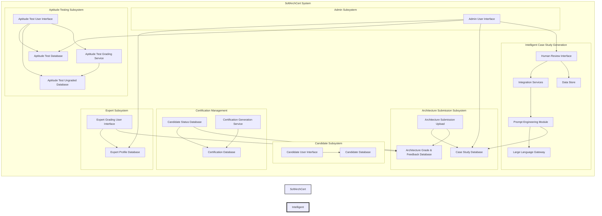

# ADR: Intelligent Case Study Generation Using AI

## ADR ID: 003

## Date: 2024-02-14  

## Status: Proposed

## 1. Introduction

Certifiable, Inc.'s SoftArchCert system is experiencing rapid growth in certification requests due to its expanding global influence. The company’s current process manually creates and updates a fixed set of architectural case studies, which is both time-intensive and vulnerable to staleness and security concerns. This ADR presents a solution to dynamically generate case studies using AI, balancing automated generation with human oversight.

## 2. Context and Problem Statement

### 2.1 Aptitude test questions

#### Background

Certifiable, Inc. offers software architecture certifications through the SoftArchCert system. The certification process involves two tests: Test 1, an aptitude test with multiple-choice and short-answer questions, and Test 2, where candidates create an architecture for a randomly assigned case study. Test 1's multiple-choice questions are auto-graded, while the short-answer questions are manually graded by expert software architects.

#### Problems Identified for Test 1 generation

- **Risk of Leakage:** Reusing questions may lead to compromised exam integrity. Due to the short nature of these questions they represent a higher risk for leakage.
- **Resource Intensive:** Number of available resources to generate tests is scarce.
- **Financial Cost:** Although this test is not a primary concern, it can act as an effective filter for candidates avoiding the need for grading test 2.

### 2.2 Case studies

#### Background

The SoftArchCert system currently uses a fixed set of manually created architectural case studies for Test 2. With an anticipated 5–10× increase in submissions and rapid shifts in industry practices, it is no longer viable to rely solely on expert architects for updating and maintaining case studies. This is exacerbated by the need to ensure that the certification process remains secure, relevant, and scalable and the fact that only 5 expert architects are available for creating these case studies.

#### Problems Identified

- **Manual Effort:** Manual creation and periodic updates are resource-intensive.
- **Content Staleness:** Static case studies risk becoming outdated as architectural best practices evolve.
- **Security Concerns:** Reused or fixed content may leak over time, compromising exam integrity.
- **Scalability Issues:** An increased number of candidates demands a larger, more varied repository of case studies and only 5 experts exist with this role in the organization.

#### AI Opportunity

Generative AI can be used to create dynamic, relevant, and varied case studies while incorporating human oversight for quality and security. Specific AI techniques—primarily through advanced prompt engineering—can be applied to ensure that the generated content meets certification standards.

## 3. Decision

### 3.1 New generation workflow

With the new hybrid intelligent generation process, the Intelligent Case Study Generation module would generate the initial case studies using the LLM and prompt engineering module. These generated case studies would then be reviewed by human experts through the Human Review Interface. The feedback and modifications made by the human reviewers would be stored in the Data Store for Expert Feedback, allowing for continuous improvement of the generation process.

Thorough validation of the prompt techniques is required in order to determine which of the following use cases can be used in the Human Review Interface:

- Initial new case study generation:
  - Contextual Prompting with Guideline Manuals is likely to be the most effective for generating new case studies.
  - Multi-turn prompting is likely to be helpful to ensure the generation is done in several steps as that tends to yield higher quality results and overcome model limitations on long form generation.
- Enhance or tweak existing case studies:
  - One-shot learning is likely to improve certain aspects of existing case studies with minimal overhead.
  - Few-shot learning is likely to be the most accurate for enhancing or tweaking existing case studies. But is only possible once a significant number of case studies have been generated.
- Generate variations of the existing case studies:
  - Zero-shot can be effective using a fine-tuned model but is likely to introduce hallucinations or overfitting.
  - One-shot prompting can be useful for generating variations of existing case studies.
  - Few-shot learning is likely to be the most effective for generating variations of existing case studies.

Given that the number of case studies in the database will be small, that each case study is comprised of long form text and spending a lot of effort categorizing the case studies is hardly worth it, the best approach is to use a general purpose semantic search engine like ElasticSearch ELSER that is an out-of-domain model. The responsibility to fetch these similar case studies will be on the prompt engineering module.

### 3.2 Additional components

- **Prompt Engineering Module:**  
  Develop a module that can generate prompts for the LLM based on the selected technique.
- **Human Review Interface:**
  Create an interface that allows human reviewers to:
  - generate new case studies using a custom prompt or resorting to the prompt library.
  - provide feedback on the generated case studies. And update them, either through the prompt library or directly.
  - review the generated case studies and provide feedback on their quality.
  - update the prompt library and guideline manuals based on the feedback received.

- **Integration Services:**
  Establish data flows between the LLM, prompt module, human review interface, and core SoftArchCert system.
- **Data Store:**
  Implement a data store to:
  - Capture expert feedback.
  - Capture performance logs for continuous improvement.
  - Store prompt libraries and guideline manuals.
- **LLM Gateway:**  
  Utilize a general-purpose LLM conforming to the OpenAI standard (e.g., Claude Sonnet) with the prompt engineering module.

## 3.3 Resulting Architecture

The following diagram illustrates how the Intelligent Case Study Generation module integrates with the existing SoftArchCert system:



## 4. Decision Drivers & Assumptions

### 4.1 Assumptions

- There is a general AI model service available that can generate text based on prompts that is on-par with recent generation models.
- There are reviewing guidelines used by the experts to maintain consistency in grading across the 300 experts doing the reviews.
- There is no evidence to support the claim that there is a low variety of questions in the aptitude test.
- The cost of calling an AI model is not a significant factor in the decision-making process when compared to the potential time savings from reducing human effort.

### 4.2 Decision Drivers

### 4.2.1 Short Answer Questions

Given that there is no data on a potential risk of leakage of having a low variety of the aptitude test questions, the focus will be on the case studies. Although such many of the techniques for generating case studies will be applicable to generating short answer questions.

### 4.2.2 Case Studies

Given the significant workload and resource constraints faced by Certifiable, Inc., the hybrid intelligent generation approach with human oversight is the most suitable option. This approach balances the benefits of AI-driven content generation with the assurance of expert quality control, ensuring that the case studies remain relevant, challenging, and secure. The diverse prompt engineering techniques will need to be evaluated to determine what is the best approach for generating case studies. The human review interface will play a crucial role in maintaining the quality and integrity of the generated content, ensuring that the certification process remains robust and credible.

## 5. Alternatives Considered

### 5.1 General approaches

#### Option 1: Maintain Full Manual Case Study Creation

- **Pros:**  
  - High-quality content with direct expert input ensuring domain accuracy.
- **Cons:**  
  - Does not scale as submission volume increases.
  - Increased cost and risk of stale content.

#### Option 2: Fully Automated Generation Without Human Review

- **Pros:**  
  - Maximum scalability and fast turnaround.
- **Cons:**  
  - Risk of generating off-target or overly generic case studies.
  - Potential security and compliance issues due to inadequate content control.
  - Very resource intensive to ensure AI-generated content meets certification standards.
  - No guarantee that the content generated will be relevant or challenging.
  - Reputational risk if the generated content is subpar.

#### Option 3: Template-Based Rule-Driven Generation

- **Pros:**  
  - Deterministic and easy to audit.
- **Cons:**  
  - Lacks the flexibility and creativity needed for evolving architectural challenges.

#### Option 4: **Hybrid Intelligent Generation with Human Oversight (Chosen Option)**

- **Pros:**  
  - Balances rapid AI-driven generation with expert quality control.
  - Dynamically refreshes content based on current industry trends.
  - Reduced expert workload: AI creates initial drafts; human reviewers ensure quality.
  - Enhances security by generating more case studies and thus reducing the impact of a compromised case study.

- **Cons:**  
  - Increased system complexity due to the integration of multiple components.
  - Requires ongoing model tuning and dedicated human oversight.
  - Will require initial human effort to develop and refine prompt engineering techniques.

### 5.2 Prompt Engineering Techniques

To generate high-quality, context-aware case studies, we propose using a diverse set of prompt engineering techniques. Each technique is designed to address specific scenarios and can be tailored with guideline manuals that provide additional context and usage instructions for case study generation.

#### 5.2.1 One-Shot Learning

**Description:** Provide a single example within the prompt to guide the model.

- **Pros:**  
  Simple and effective for straightforward scenarios.
- **Cons:**  
  May lack depth for more complex scenarios.

#### 5.2.2 Few-Shot Learning

**Description:** Supply 2–5 examples in the prompt to illustrate the desired output format and content.

- **Pros:**  
  Provides richer context, leading to more nuanced outputs.
- **Cons:**  
  Requires more data preparation.

#### 5.2.3 Zero-Shot Learning

**Description:** Provide a comprehensive and detailed prompt without any examples, relying on the LLM’s pre-trained expertise.

- **Pros:**  
  Leverages the extensive background knowledge of the model.
- **Cons:**  
  Increased risk of less targeted output.

#### 5.2.4 Multi-Turn Prompting

**Description:** Engage the LLM in an iterative dialogue, refining the output in multiple steps.

- **Pros:**  
  Iterative refinement yields highly detailed and quality outputs.
- **Cons:**  
  Requires additional computational resources and time.

#### 5.2.5 Contextual Prompting with Guideline Manuals

**Description:** Provide background guidelines or a manual with detailed instructions alongside the prompt to ensure output quality and consistency.

- **Pros:**  
  Provides comprehensive context, ensuring that the generated case study adheres to specific quality and structural requirements.
- **Cons:**  
  A very detailed prompt might overwhelm the model if not carefully balanced; requires precise formatting of guidelines.

### 5.3 Examples for short answer questions

#### 5.3.1 One-Shot Learning

**Example Prompt:**  
"Provide a short answer explaining the benefits of using microservices architecture over a monolithic architecture. Example: Microservices architecture allows for independent deployment and scaling of services, which improves flexibility and resilience."

#### 5.3.2 Few-Shot Learning

**Example Prompt:**  

"Below are two examples of short answer questions and their answers:

What are the key principles of RESTful API design? Answer: RESTful API design principles include statelessness, client-server architecture, cacheability, layered system, and uniform interface.
How does containerization benefit software deployment? Answer: Containerization provides consistency across multiple development, testing, and deployment environments, and improves resource utilization and isolation.
Now, provide a short answer explaining the advantages of using a NoSQL database over a SQL database."

#### 5.3.3 Zero-Shot Learning

**Example Prompt:**  
"Explain the concept of eventual consistency in distributed systems."

#### 5.3.4 Multi-Turn Prompting

**Example Prompt:**  

"Explain the concept of eventual consistency in distributed systems."

**Follow-up Prompt:**

"Can you provide an example scenario where eventual consistency is beneficial?"

#### 5.3.5 Contextual Prompting with Guideline Manuals

**Example Prompt:**  
"Refer to the following guidelines for answering short answer questions:

Be concise and to the point.
Use technical terms accurately.
Provide examples where applicable.
Now, explain the benefits of using serverless architecture."

### 5.4 Examples for case studies

#### 5.4.1 One-Shot Learning

**Example Prompt:**  

```
"Generate a detailed case study where a mid-sized enterprise must update its legacy system to adopt a microservices architecture. 
Example: The company’s monolithic ERP system requires modernization to improve scalability and resilience."
```

#### 5.4.2 Few-Shot Learning

**Example Prompt:**  

```
"Below are two examples of past architectural case studies:
Example 1: A financial services firm migrated from a monolithic architecture to a microservices model to enhance transaction speed and reduce downtime.
Example 2: A retail company adopted a serverless architecture to manage seasonal demand spikes.
Now, generate a new case study where a healthcare provider needs to integrate legacy systems with cloud-native applications to enhance patient data security."
```

#### 5.4.3 Zero-Shot Learning

**Example Prompt:**  

```
"Generate an innovative architectural case study for a large-scale enterprise that faces challenges integrating emerging IoT technologies with its core data infrastructure. The case study should describe the problem, propose a solution, and outline validation metrics."
```

#### 5.4.4 Multi-Turn Prompting

**Example Workflow:**  

1. **Initial Request:**  

   ```
   "Draft an initial outline for an architectural case study involving a cloud migration strategy, splitting the process into three phases. Generate phase one."
   ```

2. **Refinement:**  
   After send:  

   ```
   "Generate phase two of the cloud migration strategy, focusing on data migration and system integration."
   ```

3. **Finalization:**  
   Finally send:

   ```
   "Complete the cloud migration case study by detailing phase three, which addresses post-migration testing and optimization."
   ```

#### 5.4.5 Contextual Prompting with Guideline Manuals

**Guideline Manual for Use-Case Generation (Excerpt):**
> **Guidelines for Architectural Case Study Generation:**  
>
> - **Objective:** Generate realistic, challenging, and industry-relevant case studies for architectural certification.
> - **Content Requirements:**  
>   - Clearly define the architectural challenge.
>   - Include relevant industry context (e.g., legacy modernization, cloud migration, security compliance).
>   - Present constraints such as project timelines, regulatory requirements, or system integration challenges.
> - **Tone and Style:**  
>   - Professional and technical.
>   - Detailed with a step-by-step explanation of proposed solutions.
> - **Output Structure:**  
>   - **Introduction:** Briefly introduce the scenario.
>   - **Problem Description:** Elaborate on the challenges.
>   - **Proposed Solution:** Provide a detailed action plan.
>   - **Validation Metrics:** Include criteria for measuring success.
> - **Example:**  
>   "A leading healthcare provider needs to migrate its legacy systems to a cloud-enabled environment while ensuring compliance with regional data privacy laws. The architectural case study should focus on secure data integration and rapid scalability within a strict 30-day timeframe."

**Example Prompt:**  

```
"Using the following guidelines:
- Objective: Ensure a secure, scalable migration solution.
- Content: Include challenges related to legacy integration and data protection.
- Structure: Introduction, Problem Description, Proposed Solution, Validation Metrics.
Generate an architectural case study for a multinational corporation facing legacy integration issues and needing compliance with international data regulations."
```

## 6. Trade-Off Analysis and Economic Considerations

### Automation vs. Human Oversight

- **Automation Benefits:**  
  - Scalable generation reduces expert workload.
  - Fast turnaround with minimal manual input.

- **Human Oversight Benefits:**  
  - Maintains domain accuracy and quality.
  - Acts as a safeguard against off-target or insecure output.

### Complexity vs. Maintainability

- **Complexity:**  
  - Integration of the LLM, prompt engineering module, and human review interface increases initial complexity.
  - Upfront investment in prompt engineering techniques and human review guidelines is required.
- **Maintainability:**  
  - Ongoing oversight is required, but streamlined workflows reduce the long-term expert time.
  
### Scalability vs. Quality Assurance

- **Scalability:**  
  - AI-driven generation scales cost-effectively with growing candidate numbers.
- **Quality Assurance:**  
  - Human-in-the-loop review ensures that generated content meets strict certification standards—a crucial element to protect the company’s credibility.

## 7. Consequences

### Positive Consequences

- **Dynamic and Current Content:**  
  AI-generated case studies allow the case-studies to be in sync with the latest industry trends and practices, ensuring that the certification material is always relevant and challenging.
  
- **Cost and Time Efficiency:**  
  By reducing the expert initial case study generation time and enabling fine tuning of case studies through AI generation, we expect a significant improvement in efficiency. The savings in expert hours and increased throughput translate to a favorable ROI.

- **Scalability:**  
  The AI-driven solution will allow to create variations of existing case studies and brand new case studies. This is important to ensure that the certification process remains secure, relevant, and scalable.

- **Enhanced Quality and Security:**  
  The human-in-the-loop review process ensures that each generated case study meets strict certification standards, reducing risks associated with outdated or insecure content.
  
- **Adaptability Through Advanced Prompting Techniques:**  
  The implementation of multiple prompt engineering methods (one-shot, few-shot, zero-shot, multi-turn, and contextual prompting with guideline manuals) provides the flexibility to generate tailored case studies for a variety of scenarios and candidate levels.

In summary, by transitioning from a static, manually maintained case study repository to a dynamic, AI-augmented system, Certifiable, Inc. can maintain its market leadership, enhance operational efficiency, improve candidate assessment quality, and secure the credibility of its certification process for the future.

### Negative Consequences

- **Initial Investment:**  
  Significant upfront costs are associated with developing the prompt engineering module and human review interface, as well as integrating these components into the existing system.

- **Model Limitations:**  
  The AI model may struggle with generating highly complex or nuanced case studies, potentially requiring additional human intervention to ensure quality.

- **System Complexity:**  
  The integration of multiple new components increases the overall system complexity, which may lead to higher maintenance efforts and potential integration challenges.

- **Ongoing Oversight:**  
  Continuous human oversight is necessary to maintain the quality and relevance of the generated case studies, which may offset some of the efficiency gains.

- **Training and Adaptation:**  
  Experts and reviewers will need training to effectively use the new system and adapt to the AI-augmented workflow, which may temporarily impact productivity.

In summary, while the transition to an AI-augmented case study generation system offers significant benefits, it also introduces challenges related to initial investment, system complexity, and the need for ongoing human oversight and adaptation.

## 8. Proposed Implementation Strategy

### 8.1 Prototype Development

- **Develop a Prototype:**  
  Utilize a general purpose LLM (e.g., Claude Sonnet) with the prompt engineering module.
  Find the best prompt engineering technique for generating case studies.

- **Evaluation:**  
  Since the key objective is to enhance the expert review process and reduce the manual workload, the prototype should be evaluated based on the following criteria:
  - Reduction in case study generation time (e.g., 50% reduction).
  - Generation of diverse and relevant case studies.
  - Generation time per case study (e.g., < 5 minutes).
  - Quality of generated content based on expert feedback.

### 8.2 Human Review Interface Development

- **Design the Interface:**  
  Build a human-in-the-loop review platform featuring versioning, audit logging, and simple modification capabilities.
- **Integration:**  
  Seamlessly connect to the existing SoftArchCert administrative workflows.

### 8.3 Integration Testing and Pilot Program

- **Integration Testing:**  
  Validate data flows between the LLM, prompt module, human review interface, and core SoftArchCert system.
- **Pilot Program:**  
  Roll out a limited pilot with generated case studies and collect feedback to refine the process.

### 8.4 Full Scale Rollout and Monitoring

- **Phased Rollout:**  
  Gradually incorporate AI-generated case studies, with continuous monitoring.
- **Continuous Improvement:**  
  Use expert feedback and performance logs to further fine-tune the prompt library and LLM responses.

## 9. References

Add references for Bert and ElseR here.
