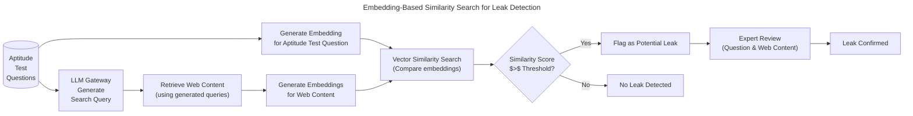
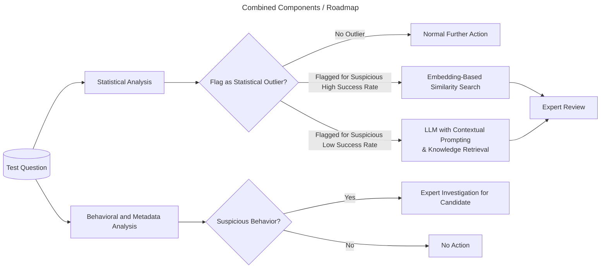
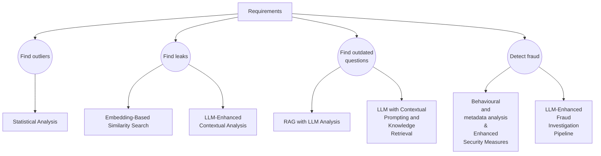
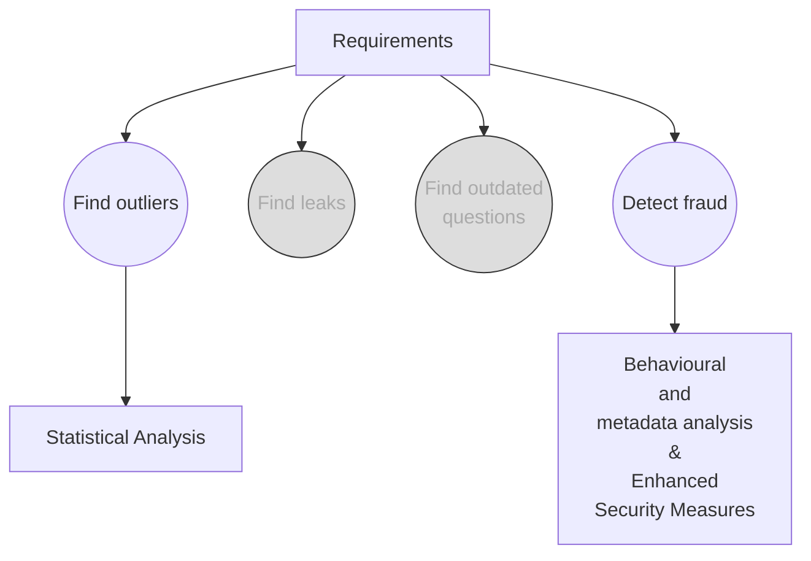
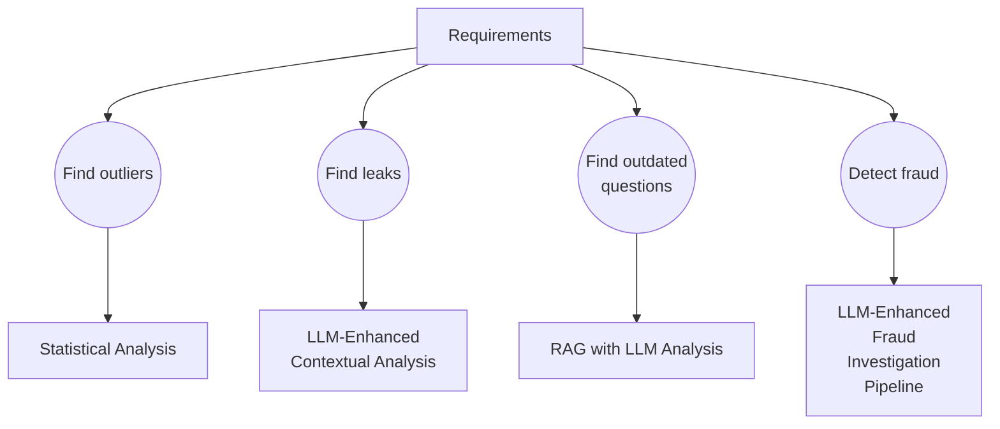

# ADR: Test Result Analysis for Software Architect Certification

## ADR ID: 004

## Date: 2025-02-19

## Status: Proposed

## 1. Introduction

Certifiable, Inc. is committed to maintaining rigorous and current certification standards for Software Architects. This ADR proposes an automated test analysis and reporting system that leverages statistical methods, embedding-based similarity searches, and LLM-enhanced evaluations. The goal is to detect atypical question performance, leaked content, outdated exam materials, and potential fraudulent activities, thereby ensuring both the integrity and efficiency of our certification process.

## 2. Context and Problem Statement

**Background:**

Our certification exam analysis is performed periodically (daily or weekly) to assure that questions remain relevant and secure. With rising candidate volumes and evolving test materials, manual review of test results is both labor-intensive and vulnerable to inconsistencies. Key challenges include:

- **Statistical Outliers:** Identifying questions or case studies with unusually high or low success rates.
- **Leaks and Outdated Content:** Detecting questions that have been leaked online or have become obsolete over time.
- **Fraud Detection:** Recognizing anomalous candidate behavior suggesting fraudulent activity.

Given the anticipated, steep growth in candidate numbers, it is imperative to automate the test analysis process to maintain the integrity and efficiency of our certification pipeline.
The current process relies on basic statistical methods but lacks automated mechanisms for comprehensive leak detection and fraud analytics.

**Scope and Limitaions of the ADR**

This ADR focuses mainly on the test analysis of questions and results of the aptitude test. From the business perspective, it is important to ensure that the aptitude test is a reliable indicator for the case study part of the certification process.
Should the test be to hard, too many candidates will fail. Potentially resulting in a loss of reputation and revenue.
But more importantly, should the test be too easy, candidates that are not ready for the case study part will pass the test, resulting in an increased workload for the case study grading team.

At a later stage, the ADR will be extended to cover the case study part as well.


## 3. Decision

### 3.1 Assumptions

- Sufficient historical test data is available for training and validating the analytical models.
- To detect outdated questions, a curated corpus of up-to-date books, blogs, and conference materials is accessible.
- In the existing architecture we already have a service for statistical analysis in place that is capable of detecting statistical outliers.
- An external service for identity verification based on photo ID and face recognition is available on the market.
- A company wide accessable LLM Gateway is available for LLM-based approaches.


### 3.2 Chosen Approach

Adopt a hybrid, AI-assisted test analysis framework that meets all key requirements in a cost-effective manner by incorporating the following components:

- **Statistical Analysis:**
  We'll continue using the existing statistical analysis service to identify questions with unusually high or low success rates. This service calculates key metrics (e.g., success rate, average time to answer, standard deviation) for every question and flags outliers based on predefined thresholds.

- **Embedding-Based Similarity Search:**
  Compares test question embeddings with crawled web content to flag potential leaks. The typical workflow for this component is outlined in [Embedding-Based Similarity Search Workflow for Leak Detection](#embedding-based-similarity-search-workflow-for-leak-detection).

- **LLM with Contextual Prompting and Knowledge Retrieval:**
  Evaluates whether a test question is outdated by retrieving recent context (e.g., books, blogs, conference materials) and prompting an LLM for analysis. An example workflow for this component is illustrated in [LLM with Contextual Prompting and Knowledge Retrieval Workflow](#llm-with-contextual-prompting-and-knowledge-retrieval-workflow).


- **Behavioral and Metadata Analysis:**
  Employs standard techniques (e.g., monitoring completion times, IP addresses, etc.) and, optionally, LLM-enhanced fraud investigation to flag suspicious test-taking behavior.
  Details can be found in the section [Behavioral and Metadata Analysis](#behavioral-and-metadata-analysis).

This hybrid approach balances comprehensive analysis with cost efficiency while controlling hardware and maintenance demands.

### 3.3 Detailed Description of New Components

#### 3.3.1 Leak Detection: Embedding-Based Similarity Search Workflow

To detect leaked content, the system will use an embedding-based similarity search to compare test question
embeddings with crawled web content.
To gather the web content it is important to feed search engines on the web with queries containing interlectual property of the company.
Therefore searching for potential leaks using the full questions or stored answers from the database is not an option.

Instead, we'll use an LLM to generate possible search queries that represent the content of the questions, but do not give away the actual question. These search queries can include keywords, domains, or other relevant information that can be used to retrieve similar content from the web.

After that the system will retrieve the web content and generate embeddings for both the query and the web content.
The system will then compare those embeddings using a vector similarity search.
If the similarity score is above a certain threshold, the system will flag the question as potentially leaked.

In a final step, an expert will review the flagged question together with the web content to make a final decision.

The following workflow illustrates the process:


#### 3.3.2 Identifing outdated questions: LLM with Contextual Prompting and Knowledge Retrieval Workflow

To identify outdated questions, the system will use a Large Language Model (LLM) that is accessable via an LLM Gateway. The LLM will be enhanced with contextual prompting and knowledge retrieval.
For this both the question and the retrieved content about state-of-the-art knowledge will be combined to generate a prompt for the LLM.
This approach will help evaluate the relevance of test questions by integrating recent context from books, blogs, and conference materials.
After the LLM has classified the question as outdated or current, an expert will review the flagged questions together with the context to make a final decision.

  ```mermaid
  ---
  title: "Hybrid LLM with Contextual Prompting"
  ---
  flowchart LR
      Q2[(Aptitude<br>Test<br>Questions)]
      RC3["Raw Context<br>(Books, Blogs, Conferences)"]
      SR3["Search/Retrieval Module<br>(Basic keyword/vector search)"]
      CP3["Contextual Prompt<br>(Integrate retrieved snippets)"]
      LLM3["LLM Gateway<br> (Prompt-based evaluation)"]
      Outcome3["Analysis: Outdated / Current"]

      Outdated[Flag as Potentially Outdated]
      Expert["Expert Review<br>(Question & Public Content)"]
      UpToData[Flag as Up-to-Date]
      OutdatedCfrmd[Outdated Confirmed]

      Q2 --> CP3
      RC3 --> SR3
      SR3 --> CP3
      CP3 --> LLM3
      LLM3 --> Outcome3
      Outcome3 --> UpToData
      Outcome3 --> Outdated
      Outdated --> Expert
      Expert --> OutdatedCfrmd
  ```

 #### 3.3.3 Fraud Protection: Behavioral and Metadata Analysis

  To detect fraudulent behavior, the system will rely on standard techniques, which are well established in the industry, given that fraudulent test takers are no single case. For this system Certifiable, Inc. will take the approach of the Linux Foundation as an example. They have years of experiences in the field offering certifcations like [CKA](https://training.linuxfoundation.org/certification/certified-kubernetes-administrator-cka/), [CKAD](https://training.linuxfoundation.org/certification/certified-kubernetes-application-developer-ckad/) or [LFCS](https://training.linuxfoundation.org/certification/linux-foundation-certified-sysadmin-lfcs/).

  The following steps will be taken:

  **Standard Techniques:**
  - Monitor completion times, IP addresses, and other metadata
  - Fingerprinting: Typing patterns, mouse movements, and other behavioral biometrics
  - Flag suspicious patterns (e.g., rapid completion, multiple logins from different locations).

  **Identity verification process:**

  Like the exams of the Linux Foundation, Certifiable, Inc. will require candidates to verify their identity by uploading a photo ID. This is a common practice in the industry and ensures that the person taking the exam is the person who is supposed to take it.

  The following steps will be taken:
  1. Require upload of photo ID for identity verification
  2. Request webcam access during the test to monitor candidate behavior
  3. Usage of face recognition technology to match the candidate with the uploaded photo ID

  Publicly available libraries will be used for this purpose.

### 3.3 Combining the components / Roadmap:
Initially we'll use the statistical analysis to identify questions that are statistical outliers, flag them accordingly and send them forward for further analysis (e.g to detect leaks or outdated content).

Questions that got flagged for a suspicious high success rate will we checked for leaks using the embedding-based similarity search. And an expert will review the flagged questions together with the web content to make a final decision.
Questions that got flagged for a suspicious low success rate will be checked for outdated content using the LLM with contextual prompting and knowledge retrieval. And an expert will review the flagged questions together with the context to make a final decision.

The behavioral and metadata analysis will be used independently to detect fraudulent behavior. If a candidate is flagged for suspicious behavior, the candidate will be investigated further by an expert.



Later on, we'll not depend on the statistical analysis anymore, but proactively use the embedding-based similarity search and the LLM with contextual prompting and knowledge retrieval to identify potential leaks and outdated content.****

## 4. Other considered options

For the listed requirements mentioned in section (2. Context and Problem Statement)[#2.-Context-and-Problem-Statement], mutliple sub-options were considered to address each requirement. The following diagram illustrates the different options considered:




### 4.1 Option 1 – Optimized for Cost Efficiency

In contrast to the chosen approach, this option focuses on the most cost-efficient solution to address the requirements.
Only the most basic statistical analysis and fraud detection methods are used, without advanced LLM or embedding-based techniques.
This still ensures to find outliers and detect fraud, but does not cover leak detection or outdated question identification.



   - **Components:**
     - Statistical Analysis
     - Behavioral and Metadata Analysis & Enhanced Security Measures

   - **Pros:** Uses basic statistical methods and fraud detection for a cost-effective solution.
   - **Cons:** Does not address leaked content or outdated question detection.

### 4.2 Option 2 – Optimized for maximum coverage and precision

This option aims to cover all requirements using the most advanced analytical methods available, including LLM-enhanced contextual analysis and fraud investigation pipelines.
Detailed description of the components can be found in the end of this section.

  - **Components:**
    - Statistical Analysis
    - LLM-Enhanced Contextual Analysis
    - RAG with LLM Analysis
    - LLM-Enhanced Fraud Investigation Pipeline
  - **Pros:** Provides robust and precise detection using enhanced LLM contextual analysis and RAG pipelines.
  - **Cons:** Significantly higher setup and maintenance costs.



Below are the detailed descriptions of the components involved in Option 2 such as:
- LLM-Enhanced Contextual Analysis
- RAG with LLM Analysis
- LLM-Enhanced Fraud Investigation Pipeline

#### 4.2.1 Leak detection – LLM-Enhanced Contextual Analysis
**Approach:**
- When a potential leak is suspected, feed both the test question and the aggregated web search results (or summary snippets) into an LLM via a carefully crafted prompt.
- The prompt instructs the LLM to assess whether the question (or significant parts thereof) appears to have been published or discussed publicly.
- The LLM can provide a qualitative judgment along with a confidence score or recommended next steps (e.g., manual verification).

#### 4.2.2 Find outdated questions – RAG with LLM Analysis
**Approach:**

Use a RAG system that leverages vector search over a curated corpus consisting of up-to-date books, blog posts, conference materials, and papers. For each question under evalutaion, retrieve related contemporary documents from the vector database
 and then use an LLM to compare the content of the question against the retrieved materials.
Components Involved:
- Vector Database: Index the up-to-date corpus based on embeddings.
- RAG Pipeline: Retrieve semantically similar documents to each test question.
- LLM: Process the question and retrieved documents to generate an analysis indicating if concepts, terminology, or technologies referenced in the question are outdated.

#### 4.2.3 Fraud detection – LLM-Enhanced Fraud Investigation Pipeline

**Approach:**
- **Integrate Multiple Data Sources:**  
  Feed structured (behavioral metrics, metadata) and unstructured (textual feedback, candidate explanations, support tickets) information into a hybrid analysis system.
- **LLM Prompting for Contextual Reasoning:**  
  Use a fine-tuned LLM drafted with prompts to assess the context and potential intent behind suspicious behaviors. For example, the LLM might review patterns, compare them to known fraud cases described in external literature, and then provide a confidence rating or narrative justification.
- **Hybrid Decision Support:**  
  Combine the LLM’s qualitative assessment with quantitative anomaly scores from traditional models.


## 5. Trade-Off Analysis

- **Coverage vs. Cost:**
  The chosen option covers all aspects (outliers, leaks, outdated content, and fraud) while keeping infrastructure and maintenance costs moderate compared to a fully advanced solution.

- **Automation vs. Maintenance:**
  Greater automation reduces manual work, but demands ongoing maintenance of the vector database and periodic LLM fine-tuning.

- **Scalability vs. Complexity:**
  Integrating multiple analytical methods increases system complexity; however, it ensures scalability to handle evolving candidate volumes without compromising quality.


## 6. Consequences

**Positive Consequences:**

- **Comprehensive Analysis:**
  Addresses atypical performance, content leakage, obsolete questions, and fraudulent behavior—all critical to certification integrity.

- **Cost Efficiency:**
  The hybrid approach meets all requirements without incurring the higher costs associated with a fully advanced system.

- **Scalability and Flexibility:**
  The modular system design allows for future enhancements (e.g., upgrading LLM capabilities or adding new data sources).

**Negative Consequences:**

- **Increased Integration Complexity:**
  Combining multiple analytical techniques requires careful system integration and periodic updates.

- **Maintenance Overhead:**
  Continuous monitoring and regular updates of the vector database and LLM components add to the operational workload.

- **Resource Allocation:**
  Sustained computational resources may be required for LLM processing and real-time similarity searches.


## 7. Implementation Plan

1. **Prototype Development and Research:**
   - Develop a proof-of-concept integrating statistical analysis, embedding-based similarity search, and LLM-based contextual assessment.
   - Validate the approach using historical test data and set evaluation metrics for each component.

2. **System Design and Component Integration:**
   - Architect modular services for each analytical component: statistical, web content indexing, LLM-based assessments, and fraud detection.
   - Define clear interfaces between components to ensure seamless integration within the existing certification pipeline.

3. **Pilot Deployment:**
   - Deploy the new system in parallel with the current method to compare performance and validate accuracy.
   - Gather expert feedback and fine-tune thresholds (e.g., similarity scores and statistical limits).

4. **Full-Scale Rollout and Monitoring:**
   - Gradually transition to the AI-assisted analysis system after successful pilot testing.
   - Implement continuous monitoring, periodic evaluations, and update schedules for both the vector database and LLM components.

5. **Documentation and Training:**
   - Develop comprehensive documentation for system maintenance.
   - Train key personnel on monitoring, troubleshooting, and updating the new system components.


## 8. Future Work

### 8.1 Extend the Analysis to Cover Case Study Questions
As mentioned in chapter [2. Context and Problem Statement](#2.-Context-and-Problem-Statement), in the future this ADR will be extended to cover the case study part as well. The same components could be used to analyze the case study questions.

### 8.2 Adjust difficulty of aptitude test based on case study performance
Given that the aptitude test represents kind of a gatekeeper for candidates to do the case study part, which is significantly more expensive to grade,
it is important to ensure that the aptitude test is as reliable as possible and filters out candidates that are not ready for the case study part. 
One way to adjust the quality of the aptitude test would be to:
1. Query for candidates that passed the aptitude test but failed the case study part
2. Identify which questions in the aptitude test those candidates failed
3. Increase the number of those kind of questions in the aptitude test, since they seem to be a good indicator for candidates that are not ready for the case study part.
