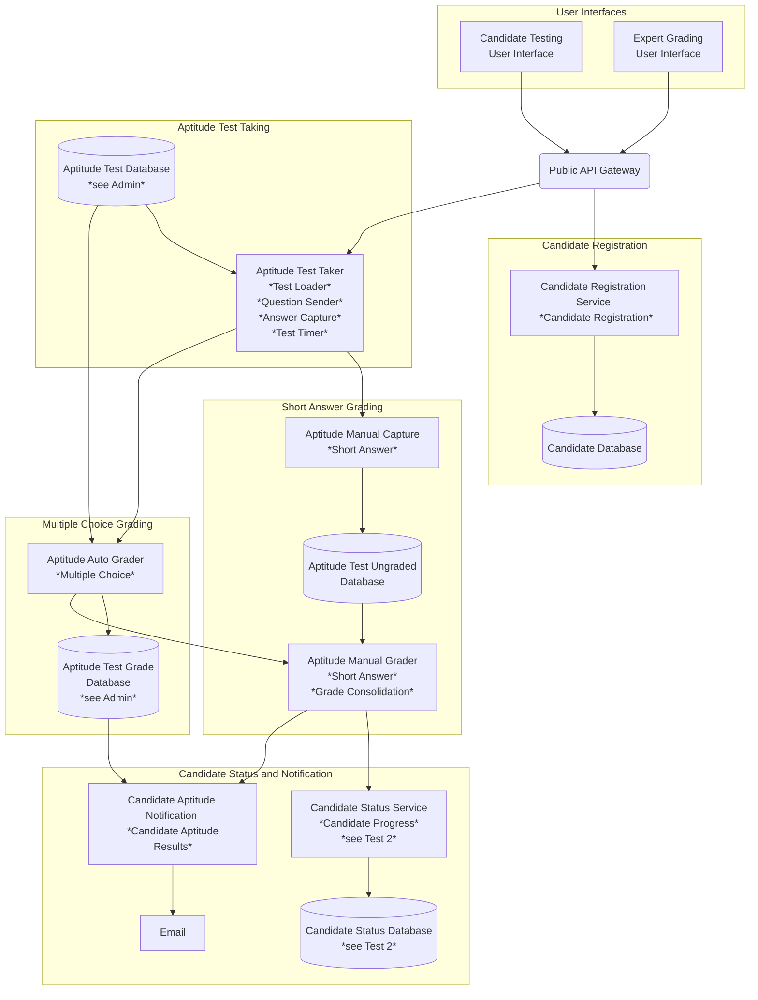
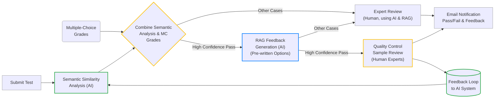
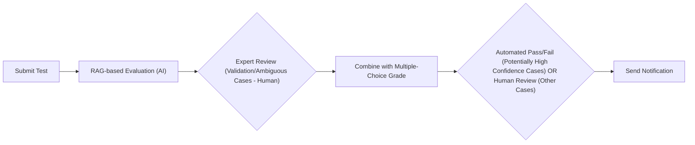
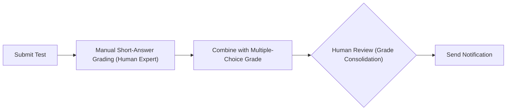
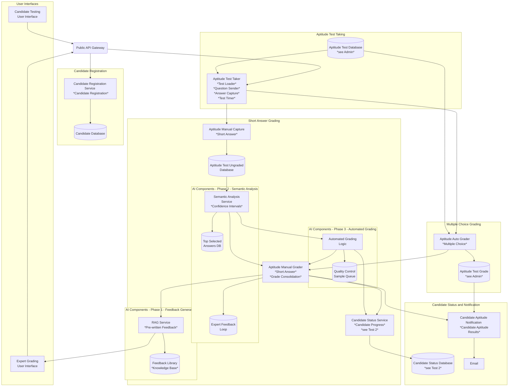

# ADR - Case Study Short Answer Grading

## ADR ID: 001

## Date: 2025-02-16

## Status: Proposed

## Context

Certifiable, Inc. anticipates a 5-10X increase in test submissions due to expanding enrollment and new partnerships. Test 1 comprises multiple-choice questions, which are automatically graded, and short-answer questions, which require manual grading by expert software architects. This manual process is time-consuming, taking up to three hours per candidate for grading short-answer questions, and poses a risk to the company's one-week grading guarantee if enhancements are not implemented. Maintaining trust in grading integrity is crucial, as even minor misclassifications could damage the brand's reputation. The company faces scalability constraints, as hiring additional expert graders is both costly and slow, and a fully automated approach without oversight might undermine trust in the nuanced evaluation of architect skills. Any new grading solution must integrate smoothly with existing test systems and data pipelines.

## Problem Statement

The challenge for Certifiable, Inc. is to introduce AI-driven short-answer grading to handle increased volumes without compromising accuracy and reputation. The solution must be scalable to manage the anticipated surge in submissions while maintaining or exceeding current human accuracy standards, with minimal false positives or negatives. Speed and efficiency are crucial for both candidate satisfaction and operational effectiveness. Retaining human oversight for ambiguous cases is essential to ensure the highest quality of results. Additionally, the system must integrate seamlessly with existing test interfaces and internal data repositories.

**Current Architecure**

## Decision

Certifiable, Inc. will implement a hybrid AI-assisted grading system for Test 1 short-answer questions to enhance efficiency and maintain grading quality.  The system will employ semantic similarity models to evaluate candidate short-answer responses by comparing them to a set of top-selected answers.  These semantic analysis results, combined with automatically graded multiple-choice scores, will generate proposed pass/fail decisions for expert software architect review.  Critically, to expedite the expert review process and ensure consistent feedback, a Retrieval-Augmented Generation (RAG) system will be integrated to provide **pre-written feedback options** for experts to choose from, alongside highlighting specific areas in candidate responses that require their focused attention.  Expert graders will retain final decision-making authority, leveraging the AI-provided suggestions and feedback to efficiently and accurately assess candidate performance.

### Option Comparison: AI-Assisted Short-Answer Grading for Test 1

This section compares three options for addressing the challenge of scaling short-answer grading for Test 1 at Certifiable, Inc.:

#### 1. Option 1: Semantic Similarity Evaluation + RAG Feedback (Chosen Solution)

**One-line Description:**  This option uses AI for initial semantic analysis and RAG-based feedback generation, followed by expert review for most cases, but automates pass/fail decisions for high-confidence cases, skipping human review in those instances, while still incorporating both AI suggestions and human judgment in the overall grading process.

**Justification:**

*   **Efficiency and Scalability:** Semantic similarity models are computationally efficient, allowing for rapid processing of large volumes of data.
*   **Cost-Effectiveness:** Avoids the need for extensive fine-tuning of large language models, reducing financial and data requirements.
*   **Enhanced Feedback and Focused Human Oversight:** RAG provides contextually relevant feedback and highlights areas for expert review.
*   **Maintaining Quality and Integrity:** Hybrid approach combines AI efficiency with essential human oversight for ambiguous cases.

**Trade-off Analysis:**

*   **Accuracy vs. Cost:** Balances accuracy needs with budgetary constraints by using semantic similarity instead of more expensive LLMs for core evaluation.
*   **Speed vs. Human Involvement:** Accelerates grading with AI while retaining human oversight for quality assurance.
*   **Feedback Quality vs. Implementation Complexity:** Justifies the added complexity of RAG with enhanced feedback quality and fairness.

**Pros:**

*   Computationally efficient and scalable.
*   Cost-effective development and deployment.
*   Transparent and auditable evaluation process.
*   Provides quantitative scores for consistent grading.
*   RAG effectively enhances feedback and expert efficiency.

**Cons:**

*   Potentially less nuanced evaluation than LLM-based approaches.
*   RAG implementation adds some complexity to the system.

---

#### 2. Option 2: RAG for Evaluation (Alternative Solution)

**One-line Description:** This option proposes using RAG, potentially with LLMs, for direct AI-driven evaluation of short-answer questions, with human review for validation and ambiguous cases, and potential automation for high-confidence outcomes.

**Justification:**

*   **Contextual Understanding:** RAG, especially with LLMs, can understand context and nuanced language for holistic evaluation.
*   **Flexibility and Adaptability:** More flexible in handling variations in candidate responses and partially correct answers.
*   **Potential for More Human-Like Assessment:** Can mimic human assessment by considering various aspects of responses.
*   **Direct Feedback Integration (Potentially):**  Evaluation model could be adapted for feedback generation.

**Trade-off Analysis:**

*   **Accuracy and Reliability Concerns:** Potential for less reliable and consistent evaluations compared to semantic similarity.
*   **Computational Cost and Latency:** Significantly higher computational cost and latency, impacting scalability.
*   **Development and Fine-tuning Complexity:** Complex to develop, fine-tune, and validate for reliable evaluation.
*   **Explainability and Auditability:**  Less transparent and auditable evaluation process.

**Pros:**

*   Potentially more nuanced and human-like evaluation.
*   High flexibility in understanding diverse responses.
*   Potential for integrated evaluation and feedback.

**Cons:**

*   Accuracy and reliability are less certain.
*   High computational cost and scalability challenges.
*   Complex development and validation process.
*   Lack of explainability and auditability raises trust concerns.
*   Quantitative assessment can be challenging.

---

#### 3. Option 3: Manual Grading (Baseline - Current Process)

**One-line Description:**  This option represents the current process of fully manual grading by expert architects, involving human evaluation of short-answer questions, combination with multiple-choice scores, and final human review for pass/fail decisions.

**Justification (for current use):**

*   **High Accuracy and Nuance:** Human experts can provide the most nuanced and accurate evaluation of complex short-answer questions.
*   **Flexibility and Adaptability:** Experts can adapt to unexpected or novel responses and apply complex judgment.
*   **High Perceived Integrity:** Manual grading is often seen as the gold standard for high-stakes assessments, fostering trust.

**Trade-off Analysis (for scaling to increased volume):**

*   **Scalability Limitations:**  Manual grading does not scale effectively to handle a 5-10X increase in submissions.
*   **Time-Consuming and Slow:**  Grading time per candidate is high (up to 3 hours), leading to delays and bottlenecks.
*   **High Cost:**  Hiring and training enough expert graders to handle increased volume is expensive and time-consuming.
*   **Consistency Challenges:**  Maintaining consistency across multiple human graders can be difficult without rigorous training and calibration.

**Pros:**

*   Highest potential for accuracy and nuanced understanding.
*   Maximum flexibility and adaptability.
*   Strong perception of grading integrity.

**Cons:**

*   Extremely poor scalability for increased submission volume.
*   Very time-consuming and slow grading process.
*   High operational costs for increased volume.
*   Potential for inconsistency across graders.

---

#### Justification for Choosing Option 1: Semantic Similarity + RAG Feedback

Certifiable, Inc. has strategically chosen **Option 1: Semantic Similarity Evaluation combined with RAG for Feedback** as the optimal solution for AI-assisted short-answer grading for Test 1. This decision is grounded in the need to balance several critical factors: **scalability, cost-effectiveness, accuracy, reliability, transparency, and maintaining trust** in the certification process.

While Option 2 (RAG for Evaluation) offers the allure of potentially more nuanced assessments, its significant drawbacks in terms of **reliability, scalability, cost, and explainability** make it a less practical and riskier choice for Certifiable, Inc.  Option 3 (Manual Grading), while highly accurate in principle, is simply **unscalable and unsustainable** for the anticipated surge in test submissions.

Option 1 provides the most **pragmatic and effective balance**. It leverages the computational efficiency and transparency of semantic similarity for core evaluation, ensuring scalability and cost-effectiveness. Simultaneously, it strategically incorporates RAG to enhance the expert grading process by providing valuable feedback options and focusing human graders' attention, thereby improving both **efficiency and feedback quality** without sacrificing **reliability or transparency**.  This hybrid approach allows Certifiable, Inc. to address the urgent need for scalability while upholding the crucial standards of accuracy, integrity, and trust that are essential for its certification program's reputation and success.

### Assumptions

**Quality of Training Data:**
It is assumed that the historical data used to train the semantic similarity models is of high quality, comprehensive, and representative of the types of responses candidates will provide. This includes having a well-defined set of ideal answers for comparison.

**Model Performance:**
We assume that the semantic similarity models will accurately assess the quality of short-answer responses based on their similarity to ideal answers. This includes the expectation that the models can effectively handle variations in phrasing and terminology used by candidates.

**Human Oversight Effectiveness:**
We assume that human experts will be able to effectively review and validate the AI-generated scores, especially for borderline cases. This includes the expectation that experts can provide valuable feedback to improve the AI models over time.

**Feedback Utility:**
It is assumed that the feedback generated by RAG will be relevant, actionable, and clear enough for candidates to understand their performance and areas for improvement.

**Integration Capability:**
It is assumed that the AI solutions can be seamlessly integrated with existing test delivery and grading systems without significant technical challenges or disruptions to current workflows.

**Data:**
We assume the data from the completed tests includes annotations indicating pass/fail status and links to the feedback provided to candidates for each short-answer question.

## Implementation Plan (Option 1)

### Phase 1: Feedback Generation Setup

During this phase, the RAG system will be configured to generate pre-written feedback based on candidate responses, utilizing a library of feedback developed for both approval and other cases. The system will provide experts with options for feedback, allowing them to select the most appropriate response to send to candidates. This setup will significantly reduce the time experts spend crafting individual feedback, streamlining the review process. Rigorous testing will be conducted to ensure that the generated feedback is relevant, clear, and actionable.

### Phase 2: Integration of Semantic Analysis and Feedback Loop

In this phase, the semantic similarity analysis will be fully integrated into the grading system. The analysis will evaluate candidate responses against the predefined set of top-selected answers, providing automated grading suggestions along with confidence intervals for each response. Experts will receive these suggestions alongside the pre-written feedback generated in the previous phase, allowing them to make informed decisions on whether to agree with or override the AI's grading suggestions. A feedback loop will be established, where experts can provide input on the AI's performance, particularly in cases where the confidence interval is low or where the AI's suggestions are disputed. This feedback will be used to continuously refine the semantic analysis model and improve its accuracy over time. Additionally, when the semantic analysis fails to provide a clear grading decision, the system will retrieve relevant examples from the RAG knowledge base to assist experts in making informed decisions. This approach ensures that the grading process remains efficient while maintaining high standards of accuracy and quality

### Phase 3: Automated Grading with Quality Control

In this phase, the system will leverage the results from the semantic similarity analysis alongside the multiple-choice scores to identify cases where there is strong evidence indicating that a candidate passes. For these cases, the system will automate the grading process, allowing candidates to move on to the second test without human intervention. To maintain quality control, a small sample of these automated decisions will be sent to human experts for review, ensuring that the system's accuracy is upheld. Additionally, for borderline cases where the confidence in the semantic analysis is lower or where there is potential for false negatives, human graders will be involved to assess the responses. If the human score is high in these borderline cases, candidates will also be allowed to progress to the second test. This approach balances efficiency with the need for oversight, ensuring that high-quality standards are maintained throughout the grading process.

---

Refer to the [diagram](#1-option-1-semantic-similarity-evaluation--rag-feedback-chosen-solution) in the section **Option 1: Semantic Similarity Evaluation + RAG Feedback (Chosen Solution)** for a visual representation of the AI-assisted short-answer grading process.

This solution employs AI for Phase 2 (green) semantic analysis, combines it with multiple-choice grades at a Phase 3 (yellow) decision point; for 'High Confidence Pass' cases, it automates pass/fail with Phase 1 (blue) RAG-generated feedback and quality control, while 'Other Cases' proceed to baseline expert review, which also utilizes RAG.

## Resulting Architecture

The resulting architecture for **Test 1 short-answer grading** combines AI-driven semantic analysis with human oversight to enhance efficiency and maintain accuracy. Semantic similarity models analyze short-answer responses, comparing them to top-selected answers and generating scores with confidence intervals. These scores are combined with multiple-choice results to create an overall confidence level for pass/fail decisions. High-confidence pass cases are automated, allowing candidates to proceed to Test 2 directly, with a small sample undergoing human quality control. Borderline cases and those with lower confidence are flagged for expert review. **To further streamline expert grading and ensure consistent feedback,** a Retrieval-Augmented Generation (RAG) system provides **pre-written feedback options** and relevant examples, particularly for ambiguous responses. A feedback loop is implemented, allowing expert graders to refine the semantic analysis model continuously. This hybrid approach optimizes grading speed, reduces expert workload, and ensures consistent, high-quality certification outcomes.

## References

1.  Sultan, A., & Salem, A. M. (2022). [Automated short answer grading systems: A systematic literature review](https://link.springer.com/article/10.1007/s10462-021-10068-2). *Education and Information Technologies*, *27*(7), 9485-9519.
2.  Lewis, P., Perez, E., Piktus, A., Petroni, F., Karpukhin, V., Goyal, N., ... & Kiela, D. (2020). [*Retrieval-augmented generation for knowledge-intensive NLP tasks*](https://proceedings.neurips.cc/paper/2020/hash/6b493230205f780e1bc26945df7481e5-Abstract.html). *arXiv preprint arXiv:2005.11401*.
3.  "Human-in-the-Loop Machine Learning." [*Google AI Blog*](https://ai.googleblog.com/2018/09/human-in-loop-machine-learning.html).