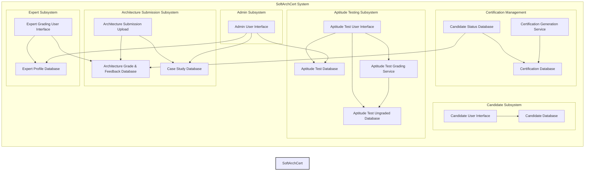

# **Unkatabel case study - Architecture Katas**

### Welcome to the **Certify-Architecture-Kata** repository!

---

## 📋 **Table of Contents**

- [📖 Overview](#📖-overview)
  - [About the Project](#about-the-project)
  - [Team Members](#🌟-team-members)
- [📝 Requirements](#📝-requirements)
  - [Functional Requirements](#functional-requirements)
  - [Non-Functional Requirements](#non-functional-requirements)
  - [Assumptions and Constraints](#assumptions-and-constraints)
- [🤔 General Assumptions](#🤔-general-assumptions)
- [🔬 Approach](#🔬-approach)
- [🔷 Architecture and Design](#🔷-architecture-and-design)
  - [Existing Architecture Diagrams](#existing-architecture-diagrams)
- [📊 Architecture Decision Records (ADRs)](#📊-architecture-decision-records-adrs)
  - [ADRs List](#adrs-list)
---

## 📖 **Overview**

### About the Project

*   **Scenario:** Certifiable, Inc. is a company that provides certifications for software architects.  They are experiencing a significant increase in certification requests due to the recent expansion of their program's acceptance in the U.K., Europe, and Asia.  Their current manual certification processes are not scalable enough to handle this increased demand.

*   **Goal:** The primary goal is to integrate Generative AI into Certifiable, Inc.'s existing "SoftArchCert" system. This integration aims to address the scalability challenges by automating or assisting with key parts of the certification process, allowing the company to handle the surge in applications without compromising the quality or integrity of their certifications.  The architecture team needs to identify specific opportunities to leverage AI and redesign the system's architecture accordingly.

*   **Existing System:** The current SoftArchCert system uses a two-test certification process:

    *   **Aptitude Test (Test 1):**  This test includes multiple-choice questions (which are automatically graded) and short-answer questions (which are manually graded by expert software architects).
    *   **Architecture Submission (Test 2):**  Candidates are given a randomly assigned case study and must design a software architecture to address it.  These architectural submissions are then manually reviewed and graded by expert software architects.

*   **Problem:** The core challenge is the manual grading process.  Grading short-answer questions in Test 1 takes approximately 3 hours per candidate, and grading architecture submissions in Test 2 takes about 8 hours per candidate.  With the anticipated increase in applications, these manual processes will become a significant bottleneck, creating delays and potentially impacting candidate satisfaction.

* **AI Opportunities:**  Certifiable, Inc. is exploring various ways to incorporate Generative AI to automate or assist in the certification process.  The primary focus is on grading and analysis tasks, where AI can potentially improve efficiency and reduce the workload on expert software architects. The current system is a perfect match to implement solutions for:
 * Test 1: AI-assisted grading for short-answer questions
 * Test 2: AI-Assisted Grading Service
 * Case studies creation: Intelligent Case Study Generation
 * Analysis of tests: AI-assisted Test Result Analysis
---

### 🌟 **Team Members**
-   **[Nuno Pacheco](https://www.linkedin.com/in/nmpacheco/)** - [Staff Engineer]
-   **[João O'Neill](https://www.linkedin.com/in/joão-m-o-neill-443aa436/)** - [Senior Site Reliability Engineer]
-   **[Alexander Knoch](https://www.linkedin.com/in/alexander-knoch-always-keep-learning/)** - [Software Egineer]
-   **[João Almeida](https://www.linkedin.com/in/joao-tiago-almeida/)** - [Software Egineer]

---

## 📝 **Requirements**

### Functional Requirements
📄 [View Functional Requirements](1_requirements/01-functional-requirements.md)  
[Briefly describe the types of functional requirements documented.  What are the core functionalities the system *must* provide?]

### Non-Functional Requirements
📄 [View Non-Functional Requirements](1_requirements/02-non-functional-requirements.md)  
[Describe the types of non-functional requirements.  This includes performance, security, scalability, usability, etc.]

### Assumptions and Constraints
📄 [View Assumptions and Constraints](1_requirements/03-assumptions-and-constraints.md)  
[Summarize the key assumptions made during development and any constraints that impacted the project.]

---

## 🤔 General Assumptions

This project operates under the following key assumptions:

*   **Data Quality:** High-quality, comprehensive, and representative historical data is available for training AI models.  This includes well-defined ideal answers and documented grading guidelines.
*   **AI Model Performance:**  Semantic similarity and text generation models will perform accurately and reliably. Fine-tuning of LLMs is assumed to be unnecessary for achieving desired performance.
*   **Human Expertise:** Human experts can effectively review AI-generated scores and feedback, especially in borderline cases, and provide valuable feedback for model improvement.
*   **Integration:** Seamless integration with existing systems is achievable without major disruptions.
*   **Submission Format:** Test submissions are compatible with AI processing, and minor adjustments to the submission process are acceptable.
*   **Scalability Constraints:**  While expert capacity can be increased, it is a lengthy process, and infrastructure costs can scale linearly with candidate volume.
*   **Short Answer Length:** Candidate responses to short-answer questions will be concise (no more than 200 words).
* **Cost:** AI inference is cost effective relative to experts.

---

## 🔬 Approach

**AI Integration in the SoftArchCert System: An Overview**

Certifiable, Inc. embarked on a strategic initiative to integrate Artificial Intelligence into their SoftArchCert system, aiming to enhance efficiency, scalability, and the overall quality of their certification process. Facing a significant increase in candidate submissions, the team recognized the limitations of purely manual processes and should leverage AI to maintain their grading standards and program integrity.

Our proposal is to start with **Test 2, the Architecture Solution submission**, which involves more complex, design-based assessments. Here, we chose to employ powerful **Large Language Models (LLMs)**, recognizing the nuanced nature of architectural grading. This **AI-Assisted Grading Service** provides preliminary grades and generates integrated feedback, pinpointing strengths and weaknesses in a candidate's architectural solution. The system also produces a **confidence score**, flagging submissions that require closer expert attention. This approach doesn't replace expert judgment but significantly streamlines the process, allowing architects to focus on refining AI-generated evaluations rather than starting from a blank slate. An important aspect of this system is a feedback loop that allows expert corrections to continuously improve the AI models over time.

Building on this success, they extended AI assistance to **Test 1, the Aptitude Test**, where they introduced **AI-assisted grading for short-answer questions**. Instead of relying solely on expert architects for every submission, they implemented a hybrid system. This system uses **semantic similarity models** to compare candidate answers against ideal responses, providing an initial assessment. To further aid the software engineer experts, they integrated a **Retrieval-Augmented Generation (RAG) system**. This RAG system generates pre-written feedback options and highlights key areas in candidate responses, drastically reducing the time experts spend crafting feedback from scratch and ensuring more consistent evaluations. For high-confidence cases, the system even automates the pass decisions, freeing up expert time for more complex submissions, while still maintaining quality control through sample reviews.

Beyond grading, the team also explored **Intelligent Case Study Generation**. Recognizing the strain on designated experts to create, update and archieve case studies manually, and the risks of content staleness and potential leaks, they proposed using AI to dynamically generate new case studies. By employing various **prompt engineering techniques** with LLMs, they aimed to create a system capable of producing diverse, relevant, and challenging case studies. This system incorporates a **human review interface**, ensuring that expert architects maintain oversight, review AI-generated content, and ensure its quality and alignment with certification standards. This hybrid approach promises to keep the case study pool fresh, secure, and scalable, reducing reliance on manual creation.

Finally, to ensure the ongoing integrity and relevance of the entire certification process, they implemented **AI-assisted Test Result Analysis**. This system uses a combination of **statistical analysis** to identify outlier questions, **embedding-based similarity search** to detect potential content leaks by comparing question embeddings to web content, and **LLMs with contextual prompting** to assess whether test questions are becoming outdated by evaluating them against current industry knowledge. Furthermore, they incorporated **behavioral and metadata analysis** to detect potentially fraudulent test-taking behaviors. This multi-faceted approach proactively identifies and addresses issues that could compromise the quality and fairness of the certification, ensuring continuous improvement and robustness of the SoftArchCert program.

In summary, Certifiable, Inc. strategically integrated AI throughout their SoftArchCert system, from aptitude tests to complex architecture submissions and even case study generation and test analysis. This hybrid approach balances the efficiency and scalability of AI with the critical oversight and nuanced judgment of expert software architects, ensuring a robust, fair, and future-proof certification process.

---

## 🔷 **Architecture and Design**

### Existing Architecture Diagrams

1. **Existing Administrative Architecture:**
    * This architecture focuses on the administrative tasks performed by Certifiable, Inc. It includes components for:
        * Managing expert software architect profiles and sign- in credentials (Expert Profile Database).
        * Adding, removing, and modifying aptitude test questions (Aptitude Test Database).
        * Adding, removing, and modifying architectural solution case studies (Case Study Database).
        * Analyzing aptitude test reports to check the validity of the aptitude certification tests (Aptitude Test Grade Database).
    * The diagram shows that designated experts access these functionalities through an Expert Admin User Interface, with an Admin API Gateway handling the requests.

2. **Existing Certification Testing Architecture (Test 1: Aptitude Test):**
    * This architecture outlines the process for the aptitude test. Key components include:
        * Candidate registration and profile information (Candidate Database).
        * Administering aptitude tests, capturing answers, and managing test timing (Candidate Testing User Interface).
        * Storing ungraded short answer questions (Aptitude Test Ungraded Database).
        * Automatically grading multiple-choice questions.
        * Enabling expert architects to retrieve ungraded short answer questions, assign grades, and provide feedback (Expert Grading User Interface).
        * Updating the candidate's certification status and notifying them of results.
    * The architecture uses queues to process answers and persist them in databases.

3. **Existing Certification Testing Architecture (Test 2: Architecture Solution):**
    * This architecture describes the process for the architecture submission. Key components include:
        * Retrieving the assigned case study (Case Study Database).
        * Uploading the architectural solution (Architecture Submissions).
        * Expert review and grading of the solution, with feedback provided to the candidate (Expert Grading User Interface).
        * Updating the candidate's certification status and notifying them of the results.
        * Generating the official certification certificate and storing it in the certification database (Certification Database).
        * Allowing candidates and company HR representatives to view and verify certification status (Certification Viewer User Interface).

In summary, the diagrams illustrate the current manual processes for test administration, grading, and certification, highlighting areas where AI could potentially be integrated to improve efficiency and handle increased demand.

---

## 📊 **Architecture Decision Records (ADRs)**

This section documents the key architectural decisions made during the project, explaining the rationale and context for each choice.

### ADRs List

-   📄 [ADR Template](ADRs/000_ADR_template.md)
-   📄 [Scaling Short-Answer Grading with Semantic Similarity and RAG](ADRs/001_adr_aptitude_test.md) - [Test 1 - Multiple Choice & Short Answers]
-   📄 [AI-Assisted Grading of Architecture Submissions](ADRs/002_adr_architecture_submission.md) - [Test 2 - Case Study that the candidate must create an architecture for]
-   📄 [Intelligent Case Study Generation Using AI](ADRs/003_adr_case_study_generation.md) - [Automated test analysis for integrity and efficiency.]
-   📄 [Test Result Analysis for Software Architect Certification](ADRs/004_adr_test_result_analysis_and_reporting.md) - [AI-driven dynamic generation of case studies with human oversight.]