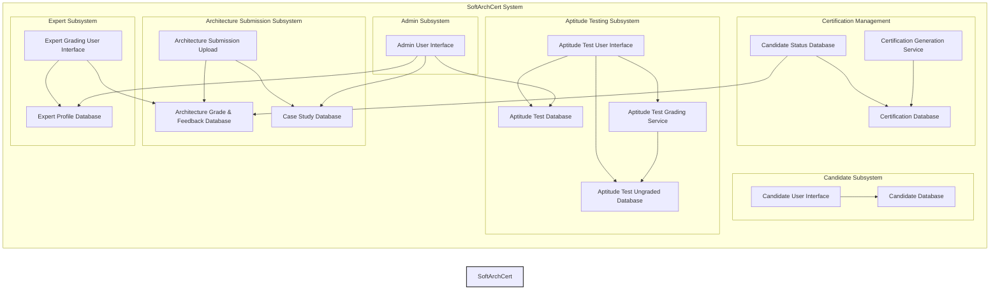

# Certify-Architecture-Kata

* **Scenario:** Certifiable, Inc., a software architecture certification
company, faces a surge in certification requests due to recent acceptance of
their certifications in the U.K., Europe, and Asia. They need to leverage
Generative AI to handle the increased demand, as their current manual
processes are insufficient.
* **Goal:** The architecture team needs to identify opportunities for using
AI within the existing SoftArchCert system and redesign the architecture to
support these changes.
* **Existing System:** The current certification process involves two tests:
  * **Aptitude Test (Test 1):** Multiple-choice and short-answer questions,
with multiple-choice auto-graded and short answers graded by expert software
architects.
  * **Architecture Submission (Test 2):** Candidates create an
architecture for a randomly assigned case study, which is then reviewed and
graded by expert software architects.
* **Problem:** The manual grading of short answer questions in Test 1 (3
hours per candidate) and architecture submissions in Test 2 (8 hours per
candidate) by expert software architects is time-consuming and will become a
bottleneck with increased volume.
* **AI Opportunities:** The company is looking for ways to apply Generative
AI to automate or assist in the certification process, particularly in grading
and analysis.
* **Constraints:**
  * **Accuracy is critical:** Inaccurate grading can negatively impact a
candidate's career and the company's credibility.
  * **Cost:** While cost is a factor, the company is willing to be somewhat
flexible for this strategic initiative.
  * **Turnaround Time:** Certifiable, Inc. guarantees a 1-week turnaround
for grading each test.
* **Deliverables:**
  * Overview narrative describing AI use
  * Diagrams for each AI use case
  * Architectural Decision Records (ADRs) with trade-off analysis
  * (Optional) Implementation details
* **Judging Criteria:**
  * Innovative use of Generative AI
  * Suitability of the solution given the constraints
  * Appropriate levels of detail
  * Use of AI architecture patterns
  * Avoidance of AI architecture anti-patterns
  * Matching architectural characteristics with the existing system
  * Validation and verification of AI results
* **Key Areas for AI Application:**
  * Grading short answer questions in Test 1
  * Grading architecture submissions in Test 2
  * Analyzing test results to improve test questions and case studies
  * Generating new case studies
* **AI Considerations:**
  * Retrieval Augmented Generation (RAG) to provide LLMs with up-to-date
and relevant data.
  * Guardrails to ensure appropriate and trustworthy responses from AI
models.
* **Existing Architecture:** The document includes diagrams of the existing
administrative and certification testing architectures for both aptitude tests
and architecture solutions.

## Existing Architecture Diagrams

1. **Existing Administrative Architecture:**
    * This architecture focuses on the administrative tasks
performed by Certifiable, Inc. It includes components for:
        * Managing expert software architect profiles and sign-
in credentials (Expert Profile Database).
        * Adding, removing, and modifying aptitude test
questions (Aptitude Test Database).
        * Adding, removing, and modifying architectural solution
case studies (Case Study Database).
        * Analyzing aptitude test reports to check the validity
of the aptitude certification tests (Aptitude Test Grade
Database).
    * The diagram shows that designated experts access
these functionalities through an Expert Admin User Interface,
with an Admin API Gateway handling the requests.

2. **Existing Certification Testing Architecture (Test 1:
Aptitude Test):**
    * This architecture outlines the process for the aptitude
test. Key components include:
        * Candidate registration and profile information
(Candidate Database).
        * Administering aptitude tests, capturing answers, and
managing test timing (Candidate Testing User Interface).
        * Storing ungraded short answer questions (Aptitude
Test Ungraded Database).
        * Automatically grading multiple-choice questions.
        * Enabling expert architects to retrieve ungraded short
answer questions, assign grades, and provide feedback (Expert
Grading User Interface).
        * Updating the candidate's certification status and
notifying them of results.
    * The architecture uses queues to process answers and
persist them in databases.

3. **Existing Certification Testing Architecture (Test 2:
Architecture Solution):**
    * This architecture describes the process for the
architecture submission. Key components include:
        * Retrieving the assigned case study (Case Study
Database).
        * Uploading the architectural solution (Architecture
Submissions).
        * Expert review and grading of the solution, with
feedback provided to the candidate (Expert Grading User
Interface).
        * Updating the candidate's certification status and
notifying them of the results.
        * Generating the official certification certificate and
storing it in the certification database (Certification
Database).
        * Allowing candidates and company HR representatives
to view and verify certification status (Certification Viewer
User Interface).

In summary, the diagrams illustrate the current manual
processes for test administration, grading, and certification,
highlighting areas where AI could potentially be integrated to
improve efficiency and handle increased demand.

