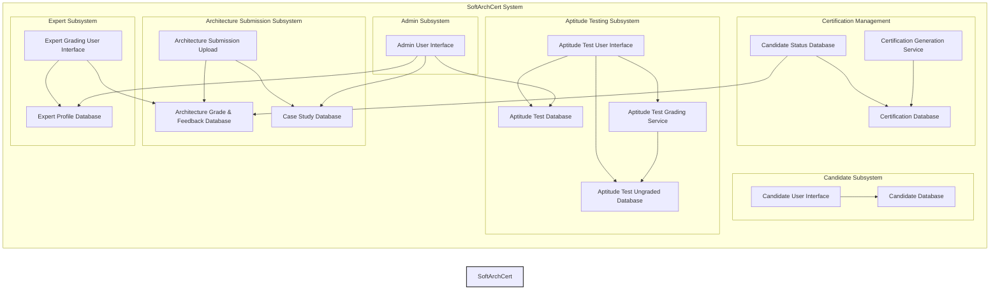

# **Unkatable case study - Architecture Katas**

- **Scenario:** Certifiable, Inc., a software architecture certification
  company, faces a surge in certification requests due to recent acceptance of
  their certifications in the U.K., Europe, and Asia. They need to leverage
  Generative AI to handle the increased demand, as their current manual
  processes are insufficient.
- **Goal:** The architecture team needs to identify opportunities for using
  AI within the existing SoftArchCert system and redesign the architecture to
  support these changes.
- **Existing System:** The current certification process involves two tests:
  - **Aptitude Test (Test 1):** Multiple-choice and short-answer questions,
    with multiple-choice auto-graded and short answers graded by expert software
    architects.
  - **Architecture Submission (Test 2):** Candidates create an
    architecture for a randomly assigned case study, which is then reviewed and
    graded by expert software architects.
- **Problem:** The manual grading of short answer questions in Test 1 (3
  hours per candidate) and architecture submissions in Test 2 (8 hours per
  candidate) by expert software architects is time-consuming and will become a
  bottleneck with increased volume.
- **AI Opportunities:** The company is looking for ways to apply Generative
  AI to automate or assist in the certification process, particularly in grading
  and analysis.
- **Constraints:**
  - **Accuracy is critical:** Inaccurate grading can negatively impact a
    candidate's career and the company's credibility.
  - **Cost:** While cost is a factor, the company is willing to be somewhat
    flexible for this strategic initiative.
  - **Turnaround Time:** Certifiable, Inc. guarantees a 1-week turnaround
    for grading each test.
- **Deliverables:**
  - Overview narrative describing AI use
  - Diagrams for each AI use case
  - Architectural Decision Records (ADRs) with trade-off analysis
  - (Optional) Implementation details
- **Judging Criteria:**
  - Innovative use of Generative AI
  - Suitability of the solution given the constraints
  - Appropriate levels of detail
  - Use of AI architecture patterns
  - Avoidance of AI architecture anti-patterns
  - Matching architectural characteristics with the existing system
  - Validation and verification of AI results
- **Key Areas for AI Application:**
  - Grading short answer questions in Test 1
  - Grading architecture submissions in Test 2
  - Analyzing test results to improve test questions and case studies
  - Generating new case studies
- **AI Considerations:**
  - Retrieval Augmented Generation (RAG) to provide LLMs with up-to-date
    and relevant data.
  - Guardrails to ensure appropriate and trustworthy responses from AI
    models.
- **Existing Architecture:** The document includes diagrams of the existing
  administrative and certification testing architectures for both aptitude tests
  and architecture solutions.

---

## 📋 **Table of Contents**

- [📖 Overview](#📖-overview)
  - [About the Project](#about-the-project)
  - [Team Members](#🌟-team-members)
- [📝 Requirements](#📝-requirements)
  - [Functional Requirements](#functional-requirements)
  - [Non-Functional Requirements](#non-functional-requirements)
  - [Assumptions and Constraints](#assumptions-and-constraints)
- [🤔 General Assumptions](#🤔-general-assumptions)
- [🔬 Approach](#🔬-approach)
- [🔷 Architecture and Design](#🔷-architecture-and-design)
  - [Existing Architecture Diagrams](#existing-architecture-diagrams)
- [📊 Architecture Decision Records (ADRs)](#📊-architecture-decision-records-adrs)
  - [ADRs List](#adrs-list)
---

## 📖 **Overview**

### About the Project

*   **Scenario:** Certifiable, Inc. is a company that provides certifications for software architects.  They are experiencing a significant increase in certification requests due to the recent expansion of their program's acceptance in the U.K., Europe, and Asia.  Their current manual certification processes are not scalable enough to handle this increased demand.

*   **Goal:** The primary goal is to integrate Generative AI into Certifiable, Inc.'s existing "SoftArchCert" system. This integration aims to address the scalability challenges by automating or assisting with key parts of the certification process, allowing the company to handle the surge in applications without compromising the quality or integrity of their certifications.  The architecture team needs to identify specific opportunities to leverage AI and redesign the system's architecture accordingly.

*   **Existing System:** The current SoftArchCert system uses a two-test certification process:

    *   **Aptitude Test (Test 1):**  This test includes multiple-choice questions (which are automatically graded) and short-answer questions (which are manually graded by expert software architects).
    *   **Architecture Submission (Test 2):**  Candidates are given a randomly assigned case study and must design a software architecture to address it.  These architectural submissions are then manually reviewed and graded by expert software architects.

*   **Problem:** The core challenge is the manual grading process.  Grading short-answer questions in Test 1 takes approximately 3 hours per candidate, and grading architecture submissions in Test 2 takes about 8 hours per candidate.  With the anticipated increase in applications, these manual processes will become a significant bottleneck, creating delays and potentially impacting candidate satisfaction.

* **AI Opportunities:**  Certifiable, Inc. is exploring various ways to incorporate Generative AI to automate or assist in the certification process.  The primary focus is on grading and analysis tasks, where AI can potentially improve efficiency and reduce the workload on expert software architects. The current system is a perfect match to implement solutions for:
 * Test 1: AI-assisted grading for short-answer questions
 * Test 2: AI-Assisted Grading Service
 * Case studies creation: Intelligent Case Study Generation
 * Analysis of tests: AI-assisted Test Result Analysis
---

### 🌟 **Team Members**
-   **[Nuno Pacheco](https://www.linkedin.com/in/nmpacheco/)** - [Staff Engineer]
-   **[João O'Neill](https://www.linkedin.com/in/joão-m-o-neill-443aa436/)** - [Senior Site Reliability Engineer]
-   **[Alexander Knoch](https://www.linkedin.com/in/alexander-knoch-always-keep-learning/)** - [Software Engineer]
-   **[João Almeida](https://www.linkedin.com/in/joao-tiago-almeida/)** - [Software Engineer]

---

## 📝 **Requirements**

### Functional Requirements

1. **Automated Grading System:**
   - Implement a Generative AI system to automate the grading of short answer questions in Test 1 (aptitude test) and architecture submissions in Test 2 to handle increased demand.
   - Ensure the AI system can evaluate answers and architectural solutions against predefined criteria and provide detailed feedback.

2. **AI-Driven Case Study Generation:**
   - Develop a system that uses AI to generate new case studies for Test 2 (architecture solution) to prevent case studies and answers from leaking out to the internet. 

3. **Candidate Management:**
   - Maintain a database of candidates, tracking their progress through the certification process, including test results, time limits, and certification status. 

4. **Certification Database Management:**
   - Update and maintain the certification database to reflect new certifications and renewals, ensuring data integrity, security, and easy verification by companies. 

5. **AI-Enhanced Feedback System:**
   - Provide candidates with AI-generated detailed feedback on their test answers and submissions to help them understand areas of improvement. 

6. **Integration with Existing Systems:**
   - Ensure the new AI systems integrate seamlessly with existing components like user interfaces, databases, and notification services to avoid disruptions in the certification process. 

7. **AI-Assisted Test Analysis:**
   - Utilize AI to analyze aptitude test reports and identify questions that need to be modified, removed, or added based on candidate performance and industry advancements. 

### Non-Functional Requirements

1. **Scalability:**
   - The system must be able to handle a 5-10X increase in certification requests without performance degradation, supporting the anticipated growth in the U.S. and overseas.

2. **Performance:**
   - Ensure that the AI grading system provides results within the current 1-week turnaround time for both Test 1 and Test 2.

3. **Accuracy:**
   - The AI grading system must maintain a high level of accuracy comparable to human expert graders to ensure the credibility of the certifications. 

4. **Reliability:**
   - The system should have high availability and reliability to support global candidates, minimizing downtime and ensuring a seamless certification experience.

5. **Security:**
   - Implement robust security measures to protect candidate data, test content, and certification information from unauthorized access or leaks.

6. **Cost Efficiency:**
   - While introducing AI, ensure that the system remains cost-effective, balancing the strategic importance of the initiative with budget constraints.

7. **User Experience:**
   - The system should provide an intuitive and user-friendly interface for candidates, administrators, and expert graders, facilitating easy navigation and use.

8. **Compliance:**
   - Ensure that the system complies with relevant data protection regulations, industry standards, and licensing board requirements, especially as the company expands internationally.

### Assumptions

* Historical Data:
Historical data  for the short answers and case study submissions is available for training AI models.  This includes detailed grading guidelines for each question and case study to ensure consistency across the 300 experts grading the tests.

* Candidate Volume:
The current volume of 200 candidates per week across the U.S. is assumed to grow 5-10 times due to overseas expansion and the anticipated 21% growth over the next 4 years.
The system is assumed to handle this increased volume without compromising on turnaround times or grading quality.

* Expert Architect Availability:
It is assumed that the current pool of 300 expert software architect consultants across the U.S. are available to handle any manual grading or verification tasks that may be required alongside the AI system.
The 5 "designated" experts are assumed to be available to modify certification tests and change/add case studies as needed, even with the increased volume.

* Certification Acceptance:
The widespread acceptance of Certifiable, Inc.'s certification across the U.S., with over 80% of companies accepting or insisting on it, is assumed to extend to the overseas markets as well.

* Cost: AI inference is cost effective relative to experts.

*   Human Expertise: Human experts can effectively review AI-generated scores and feedback and provide valuable feedback for model improvement.

*   Integration: Seamless integration with existing systems is achievable without major disruptions.
*   Submission Format: Test 1 and Test 2 submissions are compatible with AI processing, and minor adjustments to the submission process are acceptable.

### Constraints:

* Grading Turnaround Time:
The system is constrained by the guaranteed 1-week turnaround for grading both Test 1 (aptitude) and Test 2 (architecture submission), which must be maintained even with the increased volume. 

* Certification Exam Cost:
The certification exam cost of $800, which is fixed and established by the SALB, constrains the company's ability to adjust pricing to accommodate the costs of implementing the AI system.

* Certification Process Timeframe:
The system is constrained by the current timeframes for the certification process, such as the 30-day window for candidates to start Test 2 after passing Test 1 and the 2-week duration for completing Test 2.

* Expert Architect Grading Time:
The average grading time of 3 hours for short answer questions in Test 1 and 8 hours for architecture submissions in Test 2 by human expert software architects constrains the efficiency gains that can be achieved through automation. 

* System Integration:
The AI system must be integrated with the existing SoftArchCert system components, such as databases, user interfaces, and notification services, which may constrain the design and implementation choices.

* Data Security and Privacy:
The system is constrained by the need to ensure the security and privacy of candidate data, test content, and certification information, which may limit the choice of AI technologies or require additional security measures.

*   Scalability Constraints:  While expert capacity can be increased, it is a lengthy process, and infrastructure costs can scale linearly with candidate volume.

* Budget:
While Certifiable, Inc. is willing to be somewhat flexible with costs for this strategic initiative, the budget for implementing the AI system is still a constraint that needs to be considered in the solution design.

---

## 🤔 General Assumptions

This project operates under the following key assumptions:

*   **Data Quality:** High-quality, comprehensive, and representative historical data is available for training AI models.  This includes well-defined ideal answers and documented grading guidelines.
*   **AI Model Performance:**  Semantic similarity and text generation models will perform accurately and reliably. Fine-tuning of LLMs is assumed to be unnecessary for achieving desired performance.
*   **Human Expertise:** Human experts can effectively review AI-generated scores and feedback, especially in borderline cases, and provide valuable feedback for model improvement.
*   **Integration:** Seamless integration with existing systems is achievable without major disruptions.
*   **Submission Format:** Test submissions are compatible with AI processing, and minor adjustments to the submission process are acceptable.
*   **Scalability Constraints:**  While expert capacity can be increased, it is a lengthy process, and infrastructure costs can scale linearly with candidate volume.
*   **Short Answer Length:** Candidate responses to short-answer questions will be concise (no more than 200 words).
* **Cost:** AI inference is cost effective relative to experts.

---

## 🔬 Approach

**AI Integration in the SoftArchCert System: An Overview**

Certifiable, Inc. embarked on a strategic initiative to integrate Artificial Intelligence into their SoftArchCert system, aiming to enhance efficiency, scalability, and the overall quality of their certification process. Facing a significant increase in candidate submissions, the team recognized the limitations of purely manual processes and should leverage AI to maintain their grading standards and program integrity.

Our proposal is to start with **Test 2, the Architecture Solution submission**, which involves more complex, design-based assessments. Here, we chose to employ powerful **Large Language Models (LLMs)**, recognizing the nuanced nature of architectural grading. This **AI-Assisted Grading Service** provides preliminary grades and generates integrated feedback, pinpointing strengths and weaknesses in a candidate's architectural solution. The system also produces a **confidence score**, flagging submissions that require closer expert attention. This approach doesn't replace expert judgment but significantly streamlines the process, allowing architects to focus on refining AI-generated evaluations rather than starting from a blank slate. An important aspect of this system is a feedback loop that allows expert corrections to continuously improve the AI models over time.

Building on this success, we propose to extend AI assistance to **Test 1, the Aptitude Test**, where we introduce **AI-assisted grading for short-answer questions**. Instead of relying solely on expert architects for every submission, we propose a hybrid system. This system uses **semantic similarity models** to compare candidate answers against ideal responses, providing an initial assessment. To further aid the software engineer experts, we integrate a **Retrieval-Augmented Generation (RAG) system**. This RAG system generates pre-written feedback options and highlights key areas in candidate responses, drastically reducing the time experts spend crafting feedback from scratch and ensuring more consistent evaluations. For high-confidence cases, the system even automates the pass decisions, freeing up expert time for more complex submissions, while still maintaining quality control through sample reviews.

Beyond grading, the team also explored **Intelligent Case Study Generation**. Recognizing the strain on designated experts to create, update and archieve case studies manually, and the risks of content staleness and potential leaks, we propose using AI to dynamically generate new case studies. By employing various **prompt engineering techniques** with LLMs, we aim to create a system capable of producing diverse, relevant, and challenging case studies. This system incorporates a **human review interface**, ensuring that expert architects maintain oversight, review AI-generated content, and ensure its quality and alignment with certification standards. This hybrid approach promises to keep the case study pool fresh, secure, and scalable, reducing reliance on manual creation.

Finally, to ensure the ongoing integrity and relevance of the entire certification process, we propose to implement **AI-assisted Test Result Analysis**. This system uses a combination of **statistical analysis** to identify outlier questions, **embedding-based similarity search** to detect potential content leaks by comparing question embeddings to web content, and **LLMs with contextual prompting** to assess whether test questions are becoming outdated by evaluating them against current industry knowledge. Furthermore, we incorporate **behavioral and metadata analysis** to detect potentially fraudulent test-taking behaviors. This multi-faceted approach proactively identifies and addresses issues that could compromise the quality and fairness of the certification, ensuring continuous improvement and robustness of the SoftArchCert program.

In summary, Certifiable, Inc. will strategically integrate AI throughout their SoftArchCert system, from aptitude tests to complex architecture submissions and even case study generation and test analysis. This hybrid approach balances the efficiency and scalability of AI with the critical oversight and nuanced judgment of expert software architects, ensuring a robust, fair, and future-proof certification process.

---

## 🔷 **Architecture and Design**

### Existing Architecture Diagrams

1. **Existing Administrative Architecture:**
<<<<<<< HEAD
    * This architecture focuses on the administrative tasks performed by Certifiable, Inc. It includes components for:
        * Managing expert software architect profiles and sign- in credentials (Expert Profile Database).
        * Adding, removing, and modifying aptitude test questions (Aptitude Test Database).
        * Adding, removing, and modifying architectural solution case studies (Case Study Database).
        * Analyzing aptitude test reports to check the validity of the aptitude certification tests (Aptitude Test Grade Database).
    * The diagram shows that designated experts access these functionalities through an Expert Admin User Interface, with an Admin API Gateway handling the requests.

2. **Existing Certification Testing Architecture (Test 1: Aptitude Test):**
    * This architecture outlines the process for the aptitude test. Key components include:
        * Candidate registration and profile information (Candidate Database).
        * Administering aptitude tests, capturing answers, and managing test timing (Candidate Testing User Interface).
        * Storing ungraded short answer questions (Aptitude Test Ungraded Database).
        * Automatically grading multiple-choice questions.
        * Enabling expert architects to retrieve ungraded short answer questions, assign grades, and provide feedback (Expert Grading User Interface).
        * Updating the candidate's certification status and notifying them of results.
    * The architecture uses queues to process answers and persist them in databases.

3. **Existing Certification Testing Architecture (Test 2: Architecture Solution):**
    * This architecture describes the process for the architecture submission. Key components include:
        * Retrieving the assigned case study (Case Study Database).
        * Uploading the architectural solution (Architecture Submissions).
        * Expert review and grading of the solution, with feedback provided to the candidate (Expert Grading User Interface).
        * Updating the candidate's certification status and notifying them of the results.
        * Generating the official certification certificate and storing it in the certification database (Certification Database).
        * Allowing candidates and company HR representatives to view and verify certification status (Certification Viewer User Interface).
=======
   _ This architecture focuses on the administrative tasks
   performed by Certifiable, Inc. It includes components for:
   _ Managing expert software architect profiles and sign-
   in credentials (Expert Profile Database).
   _ Adding, removing, and modifying aptitude test
   questions (Aptitude Test Database).
   _ Adding, removing, and modifying architectural solution
   case studies (Case Study Database).
   _ Analyzing aptitude test reports to check the validity
   of the aptitude certification tests (Aptitude Test Grade
   Database).
   _ The diagram shows that designated experts access
   these functionalities through an Expert Admin User Interface,
   with an Admin API Gateway handling the requests.

2. **Existing Certification Testing Architecture (Test 1:
   Aptitude Test):**
   _ This architecture outlines the process for the aptitude
   test. Key components include:
   _ Candidate registration and profile information
   (Candidate Database).
   _ Administering aptitude tests, capturing answers, and
   managing test timing (Candidate Testing User Interface).
   _ Storing ungraded short answer questions (Aptitude
   Test Ungraded Database).
   _ Automatically grading multiple-choice questions.
   _ Enabling expert architects to retrieve ungraded short
   answer questions, assign grades, and provide feedback (Expert
   Grading User Interface).
   _ Updating the candidate's certification status and
   notifying them of results.
   _ The architecture uses queues to process answers and
   persist them in databases.

3. **Existing Certification Testing Architecture (Test 2:
   Architecture Solution):**
   _ This architecture describes the process for the
   architecture submission. Key components include:
   _ Retrieving the assigned case study (Case Study
   Database).
   _ Uploading the architectural solution (Architecture
   Submissions).
   _ Expert review and grading of the solution, with
   feedback provided to the candidate (Expert Grading User
   Interface).
   _ Updating the candidate's certification status and
   notifying them of the results.
   _ Generating the official certification certificate and
   storing it in the certification database (Certification
   Database). \* Allowing candidates and company HR representatives
   to view and verify certification status (Certification Viewer
   User Interface).
>>>>>>> 45bd8cc (Add Case Study evaluation ADR)

In summary, the diagrams illustrate the current manual processes for test administration, grading, and certification, highlighting areas where AI could potentially be integrated to improve efficiency and handle increased demand.

<<<<<<< HEAD
---

## 📊 **Architecture Decision Records (ADRs)**

This section documents the key architectural decisions made during the project, explaining the rationale and context for each choice.

### ADRs List

-   📄 [ADR Template](ADRs/000_ADR_template.md)
-   📄 [Scaling Short-Answer Grading with Semantic Similarity and RAG](ADRs/001_adr_aptitude_test.md) - [Test 1 - Multiple Choice & Short Answers]
-   📄 [AI-Assisted Grading of Architecture Submissions](ADRs/002_adr_architecture_submission.md) - [Test 2 - Case Study that the candidate must create an architecture for]
-   📄 [Intelligent Case Study Generation Using AI](ADRs/003_adr_case_study_generation.md) - [Automated test analysis for integrity and efficiency.]
-   📄 [Test Result Analysis for Software Architect Certification](ADRs/004_adr_test_result_analysis_and_reporting.md) - [AI-driven dynamic generation of case studies with human oversight.]
=======
## ADRs

[Case Study Evaluation](ADRs/Case_Study_Evaluation.md)

[Case Study Generation](ADRs/Case_Study_Generation.md)
>>>>>>> 45bd8cc (Add Case Study evaluation ADR)
